# Ion Contract Language — Roadmap to 1.0

> **Status:** decisions, not proposals. Every item below is committed. Cost, blast radius and ordering are the open questions; *whether* is not.
>
> **Tier 0 is complete.** All eight items (0.1–0.8) have landed. Ion no longer ships phantom surface.
>
> **Since then, five more items have landed out of tier order:** **1.2** (`Map`/`Set`), **1.6** (`decimal` +
> the `datetime` wire fix), **2.4** (mixins / `with`), **3.4** (`T[N]`) and **3.5** (inline anonymous types). Four of
> the five were tabled as blocked by **1.1** or **1.7** and shipped without them. All five are complete end to end —
> grammar, resolution, diagnostics, lock, all three runtimes, and C#/TypeScript/Rust code generation.
>
> **1.1 is still next, and is now more urgent, not less.** Mixins put fields ahead of a message's own, so retrofitting
> one reindexes everything after it; explicit indices are what would make that survivable.
>
> **Audit basis:** working tree at `master` @ `7516889`, plus the in-flight **0.1** comments workstream, which was committing *during* this audit. Every line citation below was verified against the working tree; the ones that moved mid-audit are tabulated in the appendix.

---

## Thesis

Ion's wire format is a positional CBOR array: a field's identity **is** its declaration order, and a union's discriminator **is** its case ordinal. Nothing in the language lets you say otherwise, so every schema change is silently a wire change, and `ion.lock.json` can only detect the damage after the fact. That single property makes the ordering of this roadmap non-negotiable: the features that decouple identity from position (**1.1**), that reserve envelope space (**1.5**), and that fix primitive encodings (**1.6**) are nearly free today and permanently expensive the day a third party pins a lockfile. Everything before them in Tier 0 exists because Ion currently ships phantom features — a `typedef` keyword that compiles to nothing, a `~` suffix that emits code that does not compile, an attribute lexer that splits string literals on commas — and a language cannot add surface while its existing surface is fiction.

---

> ## ✅ Tier 0 is complete — start Tier 1 with 1.1
>
> All eight Tier 0 items (0.1–0.8) have landed. Ion no longer ships phantom surface: every keyword, directive, attribute and diagnostic code the language exposes either does something or has been deleted. The three items this section used to name as gating are two-thirds retired:
>
> | # | Item | State |
> |---|---|---|
> | ~~**0.5**~~ | Fix attribute-argument lexing | **Done.** The argument list is a real grammar over a standalone literal parser. Every Tier 2 feature is attribute-delivered and now has a foundation. |
> | ~~**0.8**~~ | Converge on one C#/TypeScript generator stack | **Done.** The never-instantiated stack — both generators, both emitters, both template providers — is deleted. Generated output is unchanged. Every language feature now costs one implementation per target, not two. |
> | **1.1** | Explicit field indices + `reserved` | **Next, and now the single highest priority.** Cheapest change in the document today; the most expensive one that exists. ION0020 already instructs users to "use `reserved`" — a keyword that does not exist anywhere in the grammar. Nothing gates it any longer. |
>
> With the foundation honest, the ordering argument below reduces to one rule: **do the irreversible things while they are still free.** That means **1.1**, then **1.6** and **1.5**, before anything external pins a lockfile.

---

## 1. The organising principle: identity is position

### 1.1 The wire format

Every non-primitive Ion value is a **definite-length CBOR array**, written in field-declaration order, with no keys.

| Target | Read | Write | Citation |
|---|---|---|---|
| C# | `reader.ReadStartArray()` then N positional reads, then `ReadEndArrayAndSkip(arraySize - N)` | `writer.WriteStartArray(N)` | `src/ionc/CodeGen/IonCSharpGenerator.cs:377-389` |
| Rust | `d.array()?` then N reads, then `skip_remaining(d, len, N)` | `e.array(N)?` | `src/ionc/CodeGen/Templates/RustTemplates.cs:12-28` |
| TypeScript | positional, same shape | same | `src/ionc/CodeGen/IonTypeScriptGenerator.cs` (mirrors the C# template) |

Unions are a 2-element array `[u32 caseOrdinal, payload]`. The ordinal is the loop counter over declared cases — `src/ionc/CodeGen/IonCSharpGenerator.cs:1241/1255/1258` — read back at `:1338` and dispatched at `:1364`. An unrecognised ordinal is a hard `InvalidOperationException` (`:1343`).

**Consequences, stated plainly:**

- A field cannot be deleted. It can only be **abandoned** — left in place, ignored by readers.
- Reordering fields is a silent, total wire break.
- Inserting a field anywhere but the end shifts every subsequent field's identity.
- Adding a union case anywhere but the end reassigns every subsequent discriminator.
- Renaming a field is *free* on the wire and detected only by the lock.

### 1.2 `ion.lock.json` is a structural snapshot, not a hash

`SchemaLockGenerator.Generate` (`src/ion.compiler/SchemaLockGenerator.cs:20-63`) walks every definition and records its full layout. The critical line is `LockMsg`:

```csharp
// src/ion.compiler/SchemaLockGenerator.cs:68  (and again at :155 for union cases)
var fields = type.fields
    .Select((f, i) => new IonLockedField { Index = i, Name = ..., Type = ... })
```

`Index` is the enumeration position. There is no other source of field identity in the compiler. `IonSchemaLock.cs:70` says so in a comment: *"Locked fields for msg definitions (positional CBOR array encoding)."*

| Fact | Citation |
|---|---|
| Lock schema version is `1` | `src/ion.compiler.runtime/IonSchemaLock.cs:12` |
| `nextIndex` already exists on locked definitions ("used for safe append") | `src/ion.compiler.runtime/IonSchemaLock.cs:68` |
| Typedefs are skipped entirely when locking | `src/ion.compiler/SchemaLockGenerator.cs:28` |
| Breaking-change codes are ION0020–ION0029 | `src/ion.compiler/IonAnalyticCodes.cs:55-79` |
| ION0020 tells users to "use `reserved`" | `src/ion.compiler/IonAnalyticCodes.cs:61` |

The `reserved` keyword appears **nowhere** in the grammar, the IR, or the lock. Its only occurrences in the repository are that diagnostic string and two unrelated target-language keyword lists (`TypeScriptEmitter.cs:210`, `CSharpEmitter.cs:244`).

> **This is the whole roadmap in one sentence:** anything that changes field identity is cheap now and very expensive after 1.0.

---

## 2. Summary table

**Cost key:** S ≤ 2 days · M ≤ 1 week · L ≤ 3 weeks · XL > 3 weeks (all four targets included).

| # | Item | Tier | Cost | Wire-breaking? | Lock-breaking? | Blocked by |
|---|---|---|---|---|---|---|
| 0.1 | Comments (`//`, `///`, `//!`, `/* */`, `/** */`) | 0 | M *(done)* | No | No | — |
| 0.2 | Implement `typedef` | 0 | M *(done)* | No | **No** — the alias is erased; the lock records the underlying type at each use site | — |
| 0.3 | Implement `Partial<T>` / `T~` in all 4 targets | 0 | L *(done)* | Yes (currently emits nothing / wrong shapes) | No | 0.8 |
| 0.4 | Stop rejecting mutual recursion | 0 | S *(done)* | No | No | — |
| 0.5 | **Lex attribute arguments correctly** | 0 | S *(done)* | No | No | — |
| 0.6 | `@deprecated(since?, reason?)` | 0 | S *(done)* | No | No | 0.5 |
| 0.7 | Resolve dead / phantom surface | 0 | M *(done)* | No | No | — |
| 0.8 | **One generator stack for C#/TS** | 0 | L *(done)* | No | No | — |
| 1.1 | **Explicit field indices + `reserved`** | 1 | M | No (defaults to declaration order) | Yes (lock v2) | 0.5 |
| 1.2 | `Map<K,V>` / `Set<T>` | 1 | L *(done)* | No (new types only) | No | ~~1.1~~ landed without it |
| 1.3 | Default values + `const` | 1 | M | No | Yes (defaults recorded) | 0.5 |
| 1.4 | Open enums / unknown-value tolerance | 1 | M | No (decode-side only) | No | — |
| 1.5 | First-class errors (`throws`, `@error`) | 1 | L | **Yes if deferred** — reserve the envelope discriminant now | Yes | 0.8, 1.1 |
| 1.6 | `decimal` + datetime encoding fixes | 1 | M *(done)* | **Yes** — shipped as a break; the old `datetime` was already incompatible across runtimes | Yes | — |
| 1.7 | `#module` + import aliasing | 1 | L | No | Yes (lock v2) | 1.1 |
| 2.1 | Typed attribute args + attribute targets | 2 | M *(done)* | No | No | 0.5 |
| 2.2 | Validation constraints | 2 | L | No | No | 2.1, 1.3 |
| 2.3 | Generic *declarations* | 2 | XL | No (new types only) | Yes | 0.8, 1.1 |
| 2.4 | Mixins / `with` | 2 | M *(done)* | **Yes if retrofitted** | Yes | ~~1.1~~ landed without it |
| 2.5 | RPC semantics (`@idempotent`, `@retry`, …) | 2 | M | No | Yes (method metadata) | 2.1 |
| 2.6 | Deprecate → reserve → remove pipeline | 2 | M | No | Yes | 0.6, 1.1, 2.1 |
| 2.7 | Structured docs (`@param`/`@returns`/`@example`) | 2 | S | No | No | 0.1 |
| 3.1 | `any` / `dynamic<msg>` | 3 | L | No (new type) | Yes | 1.1 |
| 3.2 | Well-known types via `#feature` | 3 | M | No | No | 0.7 |
| 3.3 | Golden conformance vectors in `.ion` | 3 | M | No | No | — |
| 3.4 | Fixed-size collections (`T[N]`) | 3 | M *(done)* | Yes (distinct encoding) | Yes | ~~1.1~~ landed without it |
| 3.5 | Nested / inline anonymous types | 3 | L *(done)* | No | Yes | ~~1.7~~ landed without it; ION0067 guards the namespace meanwhile |

---

## 3. Dependency graph

```mermaid
graph TD
    subgraph T0["Tier 0 — fix what is broken"]
        A05["0.5 attribute arg lexing"]
        A08["0.8 one generator stack"]
        A06["0.6 @deprecated"]
        A03["0.3 Partial&lt;T&gt;"]
        A02["0.2 typedef"]
        A04["0.4 mutual recursion"]
        A07["0.7 phantom surface"]
        A01["0.1 comments"]
    end

    subgraph T1["Tier 1 — must have"]
        B11["1.1 field indices + reserved"]
        B12["1.2 Map / Set"]
        B13["1.3 defaults + const"]
        B14["1.4 open enums"]
        B15["1.5 first-class errors"]
        B16["1.6 decimal + datetime"]
        B17["1.7 #module + aliasing"]
    end

    subgraph T2["Tier 2 — should have"]
        C21["2.1 typed attribute args"]
        C22["2.2 validation constraints"]
        C23["2.3 generic declarations"]
        C24["2.4 mixins"]
        C25["2.5 RPC semantics"]
        C26["2.6 deprecation pipeline"]
        C27["2.7 structured docs"]
    end

    subgraph T3["Tier 3 — later"]
        D31["3.1 any / dynamic"]
        D32["3.2 well-known types"]
        D33["3.3 conformance vectors"]
        D34["3.4 fixed-size collections"]
        D35["3.5 nested types"]
    end

    RUSTGO["Rust client hardens"]

    A05 --> C21
    A05 --> A06
    A05 --> B11
    A05 --> B13
    C21 --> C22
    C21 --> C25
    C21 --> C26
    B11 --> C24
    B11 --> C26
    B11 --> B12
    B11 --> B17
    B11 --> C23
    B11 --> D31
    B11 --> D34
    B13 --> C22
    A06 --> C26
    A01 --> C27
    A07 --> D32
    A08 --> A03
    A08 --> B15
    A08 --> C23
    A08 -.->|halves cost of all codegen work| T2
    B15 --> RUSTGO
    B16 --> D33
    B17 --> D35

    classDef first fill:#7c2d12,stroke:#f97316,stroke-width:3px,color:#fff
    class A05,A08,B11 first
```



**Read the graph as three chains:**

1. `0.5 → 2.1 → {2.2, 2.5, 2.6}` — the attribute chain. Nothing attribute-shaped ships until the lexer works.
2. `1.1 → {2.4, 2.6, 1.2, 1.7, 2.3, 3.1, 3.4}` — the identity chain. Everything that adds or moves fields needs stable identity first.
3. `0.8 → all codegen work` — the multiplier. Two of three targets currently need every feature written twice.

And one hard gate: **1.5 must land before the Rust client hardens**, or three SDKs will each invent an incompatible failure taxonomy that then has to be unified across a stable wire.

---

# Tier 0 — "Features" that are actually broken implementations — **COMPLETE**

All eight are fixed. This tier is retained as the record of what was wrong and what the resolution was; nothing here is outstanding. **Tier 1 is the active tier, starting with 1.1.**

## 0.1 Comments — **DONE**

Broken end-to-end before this workstream: the parser treated a bare `//` line as a *doc comment*, block comments were consumed only in the `LeadingDoc` prelude, `SkipTrivia` was declared and never referenced, and **no generator emitted documentation in any language** — zero `///`, zero JSDoc, zero rustdoc.

A parallel workstream is landing the replacement now and has already rewritten the trivia layer. Delivered design, as implemented in `src/ion.syntax/Ion.Comments.cs` (`IonTriviaKind` at `:23-27`, `SkipTrivia` now live at `:108`) and surfaced to the LSP via the new `src/ionc/Lsp/IonCommentScanner.cs`:

| Form | `IonTriviaKind` | Semantics |
|---|---|---|
| `// …` | `LineComment` | Trivia. Discarded. |
| `/// …` | `DocComment` | Documentation, attaches to the **following** declaration. Built at `Ion.Comments.cs:64`. |
| `//! …` | `ModuleDocComment` | File-level module documentation → `IonFileSyntax.ModuleDoc` → `IonModule.Doc` (`src/ion.compiler.runtime/IonModule.cs:16-20`). Built at `Ion.Comments.cs:60`. |
| `/* … */` | `BlockComment` | Trivia. Discarded. Does **not** nest — the first `*/` closes (`:76`). |
| `/** … */` | `DocBlockComment` | Documentation block, attaches to the following declaration (`:75`). |

Edge cases are settled: `/**/` is an ordinary empty block comment and `////` is an ordinary line comment (`Ion.Comments.cs:16`). Per-target emission is handled by the new `src/ionc/CodeGen/DocCommentFormatter.cs`.

```ion
//! Identity and membership contracts for the Argon platform.
//! Owned by the platform team.

/// A user account.
/// Contains profile information visible to other members.
msg User {
    /// Stable, never reused.
    id: u4;
    /** The display name.
        Rendered verbatim in clients. */
    name: string;
    // internal note: this used to be `mail`
    email: string?;
}
```

**Mapping to targets:** C# `/// <summary>`, TypeScript `/** */` JSDoc, Rust `///` + `//!`.

| Surface | Work | Status |
|---|---|---|
| Parser | Replace `Ion.Comments.cs` trivia handling; attach spans to declarations — **M** | **Landed** |
| Compiler | Carry doc strings through `TransformStage` into the IR — **S** | **Landed** |
| Codegen ×4 | Emit per-target doc syntax via `DocCommentFormatter` — **S** each | **In flight** |
| LSP | Hover/folding/semantic tokens over the new trivia — **M** | **In flight** |
| Runtimes | None | — |
| Docs | `docs/src/pages/guides/comments.astro` documented the old `//`-as-doc design — **S** | **In flight** |

**Wire-breaking:** No. **Lock-breaking:** No — documentation must never reach `ion.lock.json`.

---

## 0.2 `typedef` is a no-op — **DONE**

The keyword parses, the LSP resolves it, `DuplicateSymbolValidationStage` checks it, `IonLockedDefinitionKind.Typedef` exists (`IonSchemaLock.cs:60`), and all four generators have a `GenerateTypedef` stub. None of it runs, because:

```csharp
// src/ion.compiler/TransformStage.cs:345   (called from :79)
public IReadOnlyList<IonType> CompileTypedefs(IonFileSyntax file) => [];
```

Typedefs never reach the semantic model. `SchemaLockGenerator.cs:28` then skips them for good measure.

Second defect: the parser **requires** a trailing `{ }` block —

```csharp
// src/ion.syntax/Ion.Typedef.cs:15
Char('{').Then(AnyCharExcept('}').Many()).Before(Char('}')).Then(...)
```

— so the form the documentation shows (`docs/src/pages/guides/typedefs.astro:16`) does not parse.

**Decision: implement it. Make the block optional.**

```ion
typedef UserId  = u4;
typedef Email   = string;
typedef Tick    = i8;

@description("A room identifier, scoped to a space.")
typedef RoomId = guid;

msg Membership {
    userId:   UserId;
    spaceId:  UserId;
    joinedAt: datetime;
}
```

**Settled semantics: a typedef is a TRANSPARENT ALIAS, erased at compile time.** `UserId` *is* `u4` — no wrapper, no formatter, no wire overhead, freely interchangeable with the underlying type in both directions. Erasure happens once, in `RestoreUnresolvedTypeStage`, so nothing downstream (formatters, dependency graph, schema lock) needs typedef awareness. This rules out the newtype reading: if you want a type the compiler keeps apart, use a single-field `msg`.

Four forms parse but describe nothing and are now diagnosed rather than silently dropped: no underlying type (`ION0014`), a `?`/`[]`/`~` modifier on the *name* side (`ION0015`), a generic typedef (`ION0016`), and a cyclic alias chain (`ION0017` — `CircularTypeReferenceStage` cannot catch these because it deliberately ignores self references).

| Surface | Work |
|---|---|
| Parser | Make `{ }` optional in `Ion.Typedef.cs` — **S**. The block stays accepted as vestigial back-compat; its contents were never read. |
| Compiler | Real `CompileTypedefs` (lowers to an `IonType` with `isTypedef` and a single field carrying the underlying); erasure at every use site in `RestoreUnresolvedTypeStage`; `ION0014`–`ION0017` — **M** |
| C# | `global using UserId = System.UInt32;` in `moduleInit.cs` — **S**. Fully qualified CLR names, because a `using` alias directive is resolved without regard to other usings. |
| TypeScript | `export type UserId = number;` — **S** |
| Rust | `pub type UserId = u32;` — **S** |
| LSP | Typedef reference lens; declaration-token for the alias name; hover showing `typedef Name = Underlying` and the erasure note — **S** |
| Runtimes | None. A typedef is transparent on the wire. |
| Docs | `docs/src/pages/guides/typedefs.astro`, `schema-lock.astro`, `diagnostics.astro` — **S** |

**Wire-breaking:** No — a typedef is exactly its underlying type on the wire.
**Lock-breaking:** **No.** Because the alias is erased, typedefs get *no* entry in `ion.lock.json` and the lock version is not bumped — the earlier "the lock gains `Typedef` entries" plan was dropped along with the newtype reading. Instead the lock records the **underlying type at every use site**, so changing `typedef UserId = u4` to `= u8` surfaces as `ION0022` (field type changed) once per field that used the alias, naming the affected messages rather than the alias. `IonLockedDefinitionKind.Typedef` is now unreachable and belongs on the 0.7 dead-surface list.

---

## 0.3 `Partial<T>` / `T~` is broken in all four targets — **DONE**

This is the worst item in Tier 0 — it is not "unimplemented", it is *actively wrong in four different ways*.

> **Citations below are by symbol, not line.** The line numbers in the previous revision of this section predate the comments commit and are off by roughly +41 in `IonCSharpGenerator.cs`; symbol names survive the churn.

**Syntax note:** `~` is a **suffix** — `patch: User~`, in the same position as `?` and `[]` (`IonParser.ModifierOfType` in `Ion.Messages.cs`, proven by `src/ion.syntax.test/CommentTests.cs` `Comments_AroundColonAndTypeModifiers`). The prefix form `~User` has never parsed; docs and LSP hover that showed it were wrong.

| Target | Actual behaviour | Citation |
|---|---|---|
| **C#** | Read stubs (field and argument), the argument-write stub and the return-value-write stub all `return "";` — nothing is emitted. The constructor call still lists the variable (`GenerateCaptureField` builds args from *all* fields), so the generated code fails with **CS0103: the name `__foo` does not exist**. Separately, `WriteStartArray({fieldsCount})` still counts the partial field, so even if it compiled the array arity would be wrong. **The message-field *write* path was the one thing that already worked:** `GenerateWriteField(IonField)` has no `IsPartial` branch at all, so it falls through to the generic `IonFormatterStorage<IonPartial<T>>.Write` and hits the real runtime formatter. | `IonCSharpGenerator`: dispatch in `GenerateReadField` / `GenerateReadArgument` / `GenerateWriteArgument` / the return-type switch; stubs `GenerateReadPartialField` ×2, `GenerateWritePartialField`, `GenerateWriteReturnValueForPartial`; `UnwrapType` partial arm; `GenerateWriteField(IonField)` — no partial arm |
| **TypeScript** | No `IsPartial` branch exists. `UnwrapType` falls through to `GenerateGenericTypeName` and emits the literal `Partial<Vector>` — which **collides with TypeScript's built-in `Partial<T>` utility type**, so it type-checks cleanly. It does *not* "serialise as a plain positional struct": `FormatterTemplateRef` emits `IonFormatterStorage.get<Partial<Vector>>('Partial<Vector>')`, no formatter is ever registered under that name, and `IonFormatterStorage.get` throws **`Formatter not found: Partial<Vector>`** at runtime. A clean type-check that dies on first use, not silent corruption. | `IonTypeScriptGenerator`: `UnwrapType` / `UnwrapTypeForLookup` (branch absent), `GenerateGenericTypeName`, `FormatterTemplateRef`; throw site `packages/ion.webcore.js/src/logic/IonFormatter.ts` `IonFormatterStorage.get` |
| **TypeScript, part 2** | A complete map-based partial codec **already exists and is dead**: `IonFormatter.ts` `IonFormatterStorage.makePartialFormatter` implements exactly the C# wire shape (`readStartMap`, text-string keys, `skipValue` on unknown, `null` = cleared). Repo-wide it has **zero call sites** — the definition is the only match — and it is not re-exported by name. Wire it up rather than writing a third implementation. | `packages/ion.webcore.js/src/logic/IonFormatter.ts` — `makePartialFormatter` |
| **Rust** | Mapped to `Option<T>` — a single nullable slot, not a per-field presence map. Wrong wire shape, and it *compiles*, because `ion.rustcore` has `impl<T: IonFormat> IonFormat for Option<T>`. There is no partial support in `ion.rustcore` at all. | `ITypeNameResolver.cs` — `RustTypeNameResolver.PartialWrapperName => "Option"` |

**Two runtime-level defects in the C# implementation itself**, independent of codegen:

- **`Modified(null)` and `Removed()` are indistinguishable on the wire** — both write CBOR `null`. For a `Maybe<T>` field this is deliberate and correct ("cleared" and "set to none" are the same patch). For any other field it collapses two distinct intents.
- **Value-type clearing is lossy on read.** A cleared field comes back as `PartialState.Removed`, and the single-handler `On(selector, handler)` then invokes the handler with `default!`. For a `float`/`u4` field that is `0`, which is indistinguishable from a legitimate "modified to 0" — the round-trip in `src/tests/IonTestClientServer/TestTypes.cs` `TestPartial` asserts exactly this (`y` is removed, and the assertion is `y == 0`). Consumers that need the distinction must use the two-handler `On(selector, onModified, onRemoved)` overload.

Meanwhile the C# runtime already contains a complete, coherent implementation that no generator targets:

```
src/ion.runtime/IonPartial.cs:86      PartialFormatter<T>
src/ion.runtime/IonFormatter.cs:304   registration
```

Its wire form is **a definite-length CBOR map keyed by field-name text strings**, with three states per field: key absent = untouched, key present with `null` = cleared, key present with a value = modified. Unknown keys are skipped on read. This is the one place in Ion where identity is a name rather than a position — every other type is a positional array.

**Decision: implement it properly in all four targets.** The runtime already defines the wire form; adopt it.

```ion
msg UserProfile {
    id:          u4;
    displayName: string;
    bio:         string?;
    avatarUrl:   uri?;
}

service ProfileInteraction(actor: u4) {
    /// Apply a sparse update. Absent fields are untouched;
    /// explicitly-null fields are cleared.
    Patch(id: u4, changes: UserProfile~): UserProfile;

    /// Partial in return position is legal too.
    Diff(from: u4, to: u4): UserProfile~;
}
```

| Surface | Work |
|---|---|
| Parser | None — the `~` **suffix** already parses (`Ion.Messages.cs`, `ModifierOfType`). |
| Compiler | None — `IsPartial` already flows through the IR. |
| C# codegen | Replace the four `return "";` stubs with real map read/write; exclude partial fields from the positional array count — **M** |
| TypeScript | Add the branch; emit `IonPartialOf<T>` (**do not** reuse the name `Partial`); wire up the existing dead `makePartialFormatter` rather than writing a new codec — **M** |
| Rust | New `IonPartial<T>` type + formatter in `ion.rustcore`; drop the `Option` mapping — **M** |
| Runtimes | C# largely done. `ion.webcore.js` needs `makePartialFormatter` registered; `ion.rustcore` needs the map-based formatter from scratch — **M** each |
| LSP | Hover rendered the non-existent prefix `~Data`; corrected to the suffix `Data~` — **S**, done |
| Docs | New `docs/src/pages/guides/partial.astro`; prefix-`~T` corrected across the guides — **S**, done |

**Wire-breaking:** Yes, unavoidably — three of the four targets currently produce a shape that no other target can read. There is no compatible baseline to break.
**Lock-breaking:** No — `Partial<T>` already appears in canonical type names.

> **Alternative, if this slips past 1.0:** cut `~` from the grammar entirely. A suffix that generates non-compiling C# and silently-wrong TypeScript is strictly worse than no suffix. **Recommendation: implement.** The design work is already done and sitting in `IonPartial.cs`.

---

## 0.4 Mutual recursion is falsely rejected — **DONE**

**Resolved.** Cycle detection now follows only **unconditionally owned** edges. A bare `T` field is owned; `T?`, `T[]`, `T~` and union arms are cycle-breaking, because each can terminate on the wire — absent, empty, omitted from the patch, or a different arm. The `Folder`/`Item` tree below compiles, as does any back-referencing graph. The rule also cut the other way: a **direct** self-reference `msg A { a: A; }` used to be filtered out before the search ran and is now correctly ION0030, which is right — it is a genuinely infinite type. `msg A { a: A?; }` and `msg A { children: A[]; }` are fine. Trees and graphs are expressible for the first time; the owned-edge rule is documented on the diagnostics and messages guides. The section below is kept as the record of what was wrong.

`CircularTypeReferenceStage` unwrapped `Maybe<T>`, `Array<T>` and `Partial<T>` **before** the cycle test:

```csharp
// src/ion.compiler/CircularTypeReferenceStage.cs:116-141
private static void CollectDirectReferences(IonType type, string ownerName, ...)
{
    var inner = UnwrapType(type);          // :119 — strips Maybe/Array/Partial
    if (inner.IsBuiltin || inner.IsScalar || inner.name.Identifier == ownerName)
        return;                             // :120-121
    ...
}

private static IonType UnwrapType(IonType type)   // :132-141
{
    if (type is IonGenericType { TypeArguments.Count: > 0 } gt &&
        (gt.IsMaybe || gt.IsArray || gt.IsPartial))
        return UnwrapType(gt.TypeArguments[0]);
    return type;
}
```

So this — a tree, the single most common shape in any real contract — is rejected:

```ion
msg Folder {
    id:    u4;
    items: Item[];
}

msg Item {
    id:     u4;
    parent: Folder?;
}
```

ION0030 fires (`IonAnalyticCodes.cs:57-58`, emitted at `CircularTypeReferenceStage.cs:98`) with the message *"This would cause infinite recursion during serialization"* — while its own accompanying guidance is to make the field optional, which is precisely what the user did.

**Decision: treat `T?`, `T[]` and union arms as cycle-breaking edges.** A `Maybe` can terminate (`null`); an `Array` can terminate (empty); a union arm can terminate (a different case). Only an unconditional, non-optional, non-collection self-reference chain is genuinely infinite. Union arms currently enter the adjacency graph at `:41-50` and must be excluded on the same reasoning.

| Surface | Work |
|---|---|
| Parser | None |
| Compiler | Do not unwrap before the test; skip edges through `Maybe`/`Array`/`Partial`/union arms — **S**, one function |
| Codegen ×4 | None |
| Runtimes | None |

**Wire-breaking:** No. **Lock-breaking:** No.

---

## 0.5 Attribute arguments are not lexed — **DONE**

**Resolved.** Both defects below are fixed. The argument list is a real grammar (`Ion.Attributes.cs`) over a standalone literal lexer (`Ion.Literals.cs`), and the resolver is gone — `IonAttributeBinder` matches a use against its declaration and returns diagnostics instead of throwing. The work went beyond the original scope: named arguments (`@Retry(maxAttempts: 3)`), optional parameters written `T?`, and the `on` target clause of **2.1** all landed with it, along with ION0032–ION0039 and ION0004's first outing. The two sections below are kept as the record of what was wrong.

Two independent defects.

**(a) The argument list is not tokenised.** It is captured as raw text and split on every comma:

```csharp
// src/ion.syntax/Ion.Attributes.cs:14-22
Char('(')
    .Then(AnyCharExcept(')')          // :17
        .ManyString()
        .Select(SplitAttributeArgs))
    .Before(Char(')'))

// src/ion.syntax/Ion.Attributes.cs:30-31
private static List<string> SplitAttributeArgs(string raw) =>
    StripComments(raw).Split(',').Select(a => a.Trim()).ToList();
```

`@description("Hello, world")` becomes two arguments — `"Hello` and `world"` — with no diagnostic. String literals, nested parentheses, and escapes are all invisible to the lexer. The in-flight comments workstream added comment-stripping to this span and left an explicit acknowledgement in place (`Ion.Attributes.cs:25-29`): *"Attribute arguments are still a raw, comma split character span (typed argument lexing is a separate work item)."* This item is that work item.

**(b) The resolver reads an argument's *name* where it means its *type*.**

```csharp
// src/ion.compiler/CompilationStage.cs:231
var expectedType = attr.arguments[i].name.Identifier;
if (!StdTypeParsers.TryGetValue(expectedType, out var parser))
    throw new InvalidOperationException($"Unsupported std type: {expectedType}");   // :233-234
```

So `attribute @Cache(duration: i4, key: string);` throws `Unsupported std type: key` — an unhandled exception, not a diagnostic. Any attribute whose parameter name is not coincidentally also a primitive type name is unusable. (`StdTypeParsers` is at `:251-279`.)

ION0004 — *"Type '{0}' is not allowed in attribute arguments"* — is declared at `IonAnalyticCodes.cs:31-32` and never emitted; this is where it belongs.

**Decision: fix both. Nothing in Tier 2 can proceed until this is done.**

```ion
attribute @description(text: string);
attribute @Cache(duration: i4, key: string);
attribute @length(min: u4, max: u4);

@description("A user account. Names may contain commas, e.g. \"Smith, J\".")
msg User {
    @Cache(duration: 300, key: "user")
    @length(3, 32)
    name: string;
}
```

| Surface | Work | Status |
|---|---|---|
| Parser | Real argument lexer: string literals with escapes, integers, floats, booleans, identifiers; commas only at depth 0 — **S/M**. Shares the literal grammar with **1.3**; build it once. | **Landed** — `Ion.Literals.cs` is the standalone grammar; `Ion.Attributes.cs` the argument list and the `on` clause |
| Compiler | `CompilationStage.cs:231` → read `arguments[i].type.name.Identifier`; replace the `throw` with ION0004/ION0005 diagnostics — **S** | **Landed** — `IonAttributeBinder` + `AttributeValidationStage`; nothing throws, every failure is ION0004/ION0032–ION0039 |
| Codegen ×4 | None directly; unblocks everything | **Landed** — see **0.6** |
| Runtimes | None | — |
| LSP | Not scoped originally: typed arguments make hover, signature help, completion and inlay hints answerable — **M** | **Landed** — `IonAttributeLsp.cs` plus the hover / signature-help / completion / semantic-token / inlay-hint handlers |

**Wire-breaking:** No. **Lock-breaking:** No.

---

## 0.6 `@deprecated` is declared with zero parameters — **DONE**

**Resolved.** Declared `@deprecated(since: string?, reason: string?)` on all twelve targets (`IonModule.cs`). Both parameters are *optional* rather than required, which is a deliberate departure from the plan below: `@deprecated`, `@deprecated("2.0")`, `@deprecated(reason: "…")` and `@deprecated("2.0", "…")` all bind against the one declaration, and `since` is the parameter name (not `version`). Emission for all four targets lives in `src/ionc/CodeGen/AttributeEmission.cs`. The compiler half that the plan did not ask for also landed: `DeprecatedUsageStage` raises **ION1004** at every reference to a deprecated declaration, so a deprecation is now visible in the schema and not only in the generated code.

```csharp
// src/ion.compiler.runtime/IonModule.cs:83
new("deprecated", []),
```

The documentation declares and uses a two-argument form:

```
docs/src/pages/guides/attributes.astro:17   attribute @deprecated(version: string, reason: string);
docs/src/pages/guides/attributes.astro:28   @deprecated("2.0", "Use UserV2 instead")
```

No generator emits deprecation in any language — no `[Obsolete]`, no `@deprecated` JSDoc, no `#[deprecated]`.

**Decision: give it the documented signature and emit it everywhere.**

```ion
@deprecated("2.0", "Use UserV2 instead")
msg User {
    id: u4;

    @deprecated("1.4", "Use displayName")
    name: string;
}

service OldInteraction() {
    @deprecated("3.0", "Use NewInteraction.Do")
    DoThing(): void;
}
```

| Surface | Work | Target output | Status |
|---|---|---|---|
| Parser | None (blocked on 0.5 for the two-string form) | — | — |
| Compiler | Redeclare with `(version: string, reason: string)` at `IonModule.cs:83` — **S** | — | **Landed** as `(since: string?, reason: string?)`, plus `DeprecatedUsageStage` / ION1004 |
| C# | **S** | `[Obsolete("Use UserV2 instead (deprecated since 2.0)")]` | **Landed** as `[Obsolete("Since 2.0: use UserV2 instead")]` |
| TypeScript | **S** | `@deprecated` JSDoc tag | **Landed** — `@deprecated since 2.0: use UserV2 instead` |
| Rust | **S** | `#[deprecated(since = "2.0", note = "…")]` | **Landed**, either key omitted when unwritten |
| Runtimes | None | — | — |
| Docs | Not scoped originally: `attributes.astro` documented the never-working two-required-string form | — | **Landed** — page rewritten; ION0004 un-badged and ION0032–ION0039 / ION1004 added to `diagnostics.astro` |

**Wire-breaking:** No. **Lock-breaking:** No (metadata only) — until **2.6** makes it drive the removal pipeline.

---

## 0.7 Dead / phantom surface — **DONE**

**Resolved.** Every verdict below was executed; nothing was left inert. Implemented: `#feature "x"` (now an assertion that the project enables `x`, with an error naming the `ion.config.json` key), the `internal` method modifier (the method leaves the generated client surface; the service interface and server dispatch keep it), ION0001 (module import cycle — the stage threw `NotImplementedException` and was never registered; it is implemented and registered) and ION0045 (unused imported type). Deleted: `@tag` along with `IonType.Tag`; the `vector` feature and `vec2f`…`vec4h` from the compiler, the LSP, both VS Code grammars and the config schema; ION1003 (a field is part of the wire contract, so "unused" is not meaningful for one); and ION0046 along with the module content hash that was computed and never compared. `unary` was kept as the explicit spelling of the default.

A language may not ship phantom features. Each item gets a verdict: **implement** or **delete**.

| Surface | Current state | Citation | **Verdict** |
|---|---|---|---|
| `#feature "x";` directive | Parses, is collected into `IonFileSyntax.featureSyntaxes`, and is read by exactly one consumer: the LSP semantic-token highlighter. Features are actually sourced only from `ion.config.json`. | parser `Ion.Directives.cs:69-80`; collected `Ion.Definition.cs:101`; only reader `Lsp/IonSemanticTokensHandler.cs:72-73`; real source `IonProjectConfig.cs:12,44-49` → `CompileCommand.cs:123` → `CompilationStage.cs:150-163` | **Implement.** It is the delivery mechanism for **3.2**. Make the compiler union source-declared features with config features. |
| `vector` feature (`vec2f`…`vec4h`) | Resolve in the compiler and are documented in LSP hover with C# mappings (`Vector2`, `(double,double)`, `(Half,Half)`) that do not exist. **No target maps them** — all four type resolvers fall through to emitting the raw Ion name (`vec3f`), which compiles in no language. **No runtime defines them.** | decl `IonModule.cs:91-113`; gate `CompilationStage.cs:155`; LSP `IonHoverHandler.cs:56-64`, `IonInlayHintsHandler.cs:18-20`, `IonSemanticTokensHandler.cs:191`; zero codegen/runtime hits | **Delete** from the compiler and LSP, then re-add via **3.2** as a real well-known-type feature with runtime support. Shipping a type that generates uncompilable code in every target is worse than not shipping it. |
| `@tag(n)` | Declared, parsed, modelled as `IonTagAttributeInstance`, surfaced as `IonType.Tag` — and read by nothing. `IonType.Tag` has zero consumers repo-wide. | decl `IonModule.cs:81`; resolve `CompilationStage.cs:219-220`; model `IonAttributeInstance.cs:18`; accessor `IonModule.cs:237` | **Implement.** CBOR tags are how **1.6** (`decimal`, tag 4) and **1.2** (sets, the registered set tag) reach the wire. `@tag` is the general mechanism; wire it into all four formatters. |
| `internal` method modifier | Parses; LSP hover claims internal methods are "not exposed to external clients"; **nothing enforces this**. Only `Stream` is ever branched on. | parser `Ion.Services.cs:28`; enum `IonMessageSyntax.cs:94`; only branch `IonModule.cs:277`; LSP fiction `IonHoverHandler.cs`, `IonLspHelpers.cs` | **Implement** as a codegen-only visibility filter: omit from client SDKs, keep in server executors. This is the acceptable form of conditional compilation (see *Rejected*). |
| `unary` method modifier | Parses, never branched on. It is also the default — a method with no modifier is already unary. | parser `Ion.Services.cs:27`; enum `IonMessageSyntax.cs:92` | **Delete.** A no-op keyword that restates the default is pure noise. |
| `ImportCycleDetectionStage` | `DoProcess()` throws `NotImplementedException`; the stage is not registered in `ConfigurePipeline`. ION0001 can never fire in a real compilation. `Run(...)` is reachable only from two unit tests. | throw `ImportCycleDetectionStage.cs:64`; pipeline `CompilationPipeline.cs:24-40`; ION0001 site `:54`; tests `ion.syntax.test/CompilerTest.cs:14,19` | **Implement.** Register the stage, implement `DoProcess`, keep ION0001. `#import` cycles are a real failure mode once **1.7** lands. |
| ION0004 | Declared, never emitted. Attribute-argument type errors throw raw exceptions instead. | `IonAnalyticCodes.cs:31-32` | **Implement** as part of **0.5**. |
| ION0045 (`ModuleUnusedImport`) | Declared, never emitted. Documented as live at `docs/…/diagnostics.astro:290-292`. | `IonAnalyticCodes.cs:102-103` | **Implement.** `UnusedSymbolDetectionStage` already emits ION1001/ION1002 (`:87`/`:48`); extend it to module imports. |
| ION0046 (`ModuleLockMismatch`) | Declared, never emitted. There is no module content hash. | `IonAnalyticCodes.cs:104-105` | **Delete** the code, or implement module hashing as part of **1.7**. Do not leave it declared. |
| ION1003 (`UnusedField`) | Declared, never emitted. | `IonAnalyticCodes.cs:87-88` | **Delete.** "Field never used by any service method" is a false signal in a contract language — messages exist to be sent, not to be referenced by local methods. |
| `IonTypeConstraint` | `abstract record` with zero derived types and zero references. Cannot be instantiated. | `IonModule.cs:204` | **Delete.** Re-introduce with **2.3** when generic constraints become real. |
| `IonArray` (IR record) | `IonArray(type, rank, IsFixedSize)` is never constructed anywhere. `IsFixedSize` and `rank` appear exactly once each — in the declaration. Arrays actually use the `Array<T>` generic. Name-collides with the live C# runtime type `IonArray<T>` (`ion.runtime/IonMaybe.cs:35`). | `IonModule.cs:255`; real path `IonModule.cs:74` → `CompilationStage.cs:90-91` | **Delete now, re-add with 3.4.** The name collision alone justifies removal. |
| `IonParser.IntExpression` | Public, never composed into any rule. Contains an unreachable `throw` at `:21`. `IonParser.Integer` is dead by transitivity — referenced only from inside `IntExpression`. | `Ion.Flags.cs:14-27`; `Integer` `:9-12`; the live path is `Expression` at `:51-52` | **Delete.** **1.3** replaces it with a real literal-expression grammar, which is where `<<` belongs. |
| ~~`SkipTrivia`~~ | ~~Private, never referenced.~~ **Resolved during this audit** — the **0.1** workstream rewrote the trivia layer and `SkipTrivia` is now the live whitespace/comment skipper used throughout the grammar. | `Ion.Comments.cs:108` | **No action.** Superseded by **0.1**. |

**Net:** 7 implement, 5 delete, 1 resolved in flight. None of it is wire-breaking or lock-breaking.

---

## 0.8 Two competing generator stacks for C# and TypeScript — **DONE**

**Resolved.** The unreachable half is deleted: `CSharpCodeGenerator`, `TypeScriptCodeGenerator`, `Emitters/CSharpEmitter`, `Emitters/TypeScriptEmitter`, `Templates/CSharpTemplates` and `Templates/TypeScriptTemplates`. The shipping path is unchanged — legacy `IonCSharpGenerator` / `IonTypeScriptGenerator` for C# and TypeScript, plus the emitter and template stack for Rust, which remains live. **Deleting it changed no generated output.**

There were two generator architectures in `src/ionc/CodeGen`. Only one shipped for C# and TypeScript.

**Shipping (legacy):** verbatim `"""` string templates chained through `.Replace("{placeholder}", …)` and assembled with `StringBuilder` — 72 `.Replace` calls in `IonCSharpGenerator.cs`, 44 in `IonTypeScriptGenerator.cs`.

**Never instantiated:**

| File | Lines |
|---|---|
| `src/ionc/CodeGen/CSharpCodeGenerator.cs` | 607 |
| `src/ionc/CodeGen/TypeScriptCodeGenerator.cs` | 376 |
| `src/ionc/CodeGen/Templates/CSharpTemplates.cs` | 388 |
| `src/ionc/CodeGen/Emitters/CSharpEmitter.cs` | 270 |
| `src/ionc/CodeGen/Templates/TypeScriptTemplates.cs` | 249 |
| `src/ionc/CodeGen/Emitters/TypeScriptEmitter.cs` | 243 |
| **Total dead** | **2 133** |

Every generator construction site in the repository:

| Line | Constructed | Stack |
|---|---|---|
| `CompileCommand.cs:281` | `new IonTypeScriptGenerator(project.Name)` | legacy |
| `CompileCommand.cs:314` | `new RustCodeGenerator(project.Name)` | **new** |
| `CompileCommand.cs:532` | `new IonCSharpGenerator(@namespace)` | legacy |
| `CompileCommand.cs:534` | `new IonTypeScriptGenerator(@namespace)` | legacy |

**Important correction to the original audit:** `CodeGeneratorBase.cs` (411 lines) and `CodeGen/TemplateContext.cs` (22 lines) are **live** — `RustCodeGenerator.cs` inherits from the base and constructs `TemplateContext`. Deleting them breaks Rust. The new architecture is not dead; only its C# and TypeScript ports are.

There is also a **shadowed duplicate type**: the live `ion.compiler.CodeGen.TemplateContext` (`TemplateContext.cs:3`) shadows an unreachable `TemplateContext : Dictionary<string,string>` at `Templates/ITemplateProvider.cs:156`, whose `SetIf` method (`:164`) is defined and never called — proof of unreachability.

**The dead stack has fixes the shipping stack lacks.** `CSharpCodeGenerator.GenerateDefensiveReadField` (`CSharpCodeGenerator.cs:502-525`, called from `:431`) emits a positional bounds check:

```csharp
// src/ionc/CodeGen/CSharpCodeGenerator.cs:524
return $"var {varName} = arraySize > {fieldIndex} ? {readExpr} : default!;";
```

A field absent from a shorter array written by an *older* sender yields `default!` instead of throwing. The legacy generator only handles the opposite direction — `ReadEndArrayAndSkip(arraySize - {fieldsCount})` at `IonCSharpGenerator.cs:379` discards *trailing surplus* from newer senders, but never checks per-field bounds, so an older sender's shorter array throws mid-read. The same one-directional pattern repeats at `IonCSharpGenerator.cs:753-757, 785-789, 804-808, 1337`.

**Decision: converge on ONE stack for C# and TypeScript before adding language features.**

Direction: **retire the legacy `IonCSharpGenerator` / `IonTypeScriptGenerator` and finish the emitter/template stack**, because Rust is already on it — that is 1 of 3 targets converged for free, and the alternative (porting Rust backwards onto string-replace) is strictly worse. Wire `CreateGenerator` (`CompileCommand.cs:529-536`) to the new classes, port the legacy behaviour the new stack still lacks, then delete 2 133 lines.

Note that the new stack **does not** fix `Partial<T>` — `CSharpCodeGenerator.cs:493, 517, 521-522` reproduce the same `return ""` short-circuit (`{ IsPartial: true } => null` / `return ""; // Partial — TODO`). **0.3** is still required after **0.8**.

| Surface | Work |
|---|---|
| Parser / Compiler | None |
| C# codegen | Port formatter, executor, client-proxy and csproj-patch behaviour onto the emitter stack; verify byte-identical output against `src/tests/Contracts/models/*` — **L** |
| TypeScript codegen | Same — **M/L** |
| Rust | None — already converged |
| Runtimes | None |

**Wire-breaking:** No, and this must be enforced — golden-output diffs against the checked-in `src/tests/Contracts/` generated files are the acceptance gate.
**Lock-breaking:** No.

---

# Tier 1 — Must-have language features, in this order

## 1.1 Explicit field indices + `reserved`

**The single highest-leverage change in this document.** Today a field's wire identity is `Select((f, i) => …)` in `SchemaLockGenerator.cs:59-66`. That means: never reorder, never insert, never delete. `nextIndex` already exists on `IonLockedDefinition` (`IonSchemaLock.cs:68`) to support safe append — it just has no syntax behind it.

And ION0020's own message text already instructs users to reach for a keyword that does not exist:

```
// src/ion.compiler/IonAnalyticCodes.cs:61
"Breaking change: field '{0}' (index {1}) was removed from '{2}'. Use 'reserved' or '--update-lock' to acknowledge."
```

**Proposed syntax:**

```ion
msg User {
    reserved 2, 4..6;
    reserved "email", "legacyToken";

    @idx(0) id:          u4;
    @idx(1) displayName: string;
    @idx(3) createdAt:   datetime;
    @idx(7) locale:      string?;

    // No @idx — appended at nextIndex, i.e. 8.
    timezone: string?;
}

union Event {
    @idx(0) Created(at: datetime),
    @idx(1) Renamed(from: string, to: string),
    @idx(3) Deleted(at: datetime, by: u4)
}
```

**Rules:**

1. An unindexed field takes `max(assigned) + 1`, so a file with no `@idx` at all behaves exactly as today. **Adopting indices is opt-in and non-breaking.**
2. `reserved n` and `reserved "name"` are compile errors to reuse — index and name respectively.
3. `reserved 4..6` is an inclusive range.
4. `@idx` on a union case fixes the discriminator ordinal.
5. Mixing indexed and unindexed fields is legal; assignment is deterministic.

| Surface | Work |
|---|---|
| Parser | `reserved` statement in message/union bodies; `@idx` is an ordinary attribute once **0.5** lands — **M** |
| Compiler | Index assignment pass; duplicate/reserved-collision diagnostics (new ION0014/ION0015); feed real indices to `SchemaLockGenerator` instead of `i` — **M** |
| C# / TS / Rust | Emit reads/writes in *index* order rather than declaration order; skip reserved slots by writing `null` — **S** each, given **0.8** |
| Runtimes | None |
| Lock | `IonLockedDefinition` gains `reserved`; bump `IonSchemaLock.CurrentVersion` from `1` to `2` (`IonSchemaLock.cs:12`) — **S** |

**Wire-breaking:** No, if unspecified indices keep defaulting to declaration order.
**Lock-breaking:** Yes — lock schema v2. Do this once and fold **0.2**, **1.3** and **1.7** into the same bump.

---

## 1.2 Maps and sets — **DONE (front end); code generation outstanding**

> **Delivered.** `Map<K, V>` and `Set<T>` are builtin generics beside `Maybe`/`Array`/`Partial`, with no shorthand
> suffix. `Map` is a definite-length CBOR map with keys in canonical RFC 8949 order; `Set` is tag 258 over a sorted
> array. Keys are restricted to the integral scalars, `bool`, `duration`, `string`, `guid` and enums (**ION0061**);
> floats are excluded because `-0.0`/`0.0` encode differently but compare equal and `NaN` is not equal to itself, so a
> float-keyed map cannot reproduce its own key set. Arity is checked for all five generics (**ION0060**), and nested
> generic arguments parse and resolve for the first time. Landed **without** 1.1, which it was tabled as blocked by.
>
> Code generation is complete: C# `Dictionary<K,V>` / `HashSet<T>`, TypeScript `Map<K,V>` / `Set<T>`, Rust
> `HashMap<K,V>` / `HashSet<T>`. Keys are sorted canonically on write, so two maps
> built in opposite insertion orders serialise to identical bytes; that is proven by test, not asserted.

The original entry follows.

**Ion had no associative type.** The standard module defined exactly three generics — `Maybe<T>`, `Array<T>`, `Partial<T>` — and searching the IR and syntax for `Map`, `Set` or `Dictionary` returned nothing. Every user modelling a keyed collection was forced into `msg KV { k: string; v: V; }` followed by `KV[]`: three definitions, an O(n) lookup, and no uniqueness guarantee.

CBOR has a native map major type (5) and a registered tag for sets. Encoding a map as a map is *cheaper* than the `KV[]` workaround — one array header and two values per entry become one map header and two values per entry, with no per-entry struct wrapper.

```ion
msg UserSettings {
    // Keys restricted to scalar / string / enum.
    flags:       Map<string, bool>;
    quotas:      Map<Region, u8>;
    memberIds:   Set<u4>;
    labels:      Map<string, string[]>;
    overrides:   Map<string, Setting>?;
}

enum Region: u2 { Eu, Us, Apac }
```

**Rules, fixed up front:**

1. Key types are restricted to scalars, `string`, `guid`, `uri` and enums. No message keys, no nested collections as keys, no `Maybe` keys.
2. Encoding: `Map<K,V>` is CBOR major type 5. `Set<T>` is CBOR tag 258 wrapping an array.
3. **Canonical key ordering is RFC 8949 §4.2** — bytewise lexicographic on the encoded key. This must be settled now; retrofitting a canonical order after users have signed or hashed payloads is a wire break.
4. Duplicate keys are a decode error, not a last-write-wins merge.

| Surface | Work |
|---|---|
| Parser | None — `Map<K,V>` parses today via `GenericParameterList`. |
| Compiler | Register `Map`/`Set` as special generics alongside `Array` (`CompilationStage.cs:90-91`); key-type constraint diagnostic; canonical type names for the lock — **M** |
| C# | `IonMap<K,V>` / `IonSet<T>` + formatters, mirroring `IonArray<T>` — **M** |
| TypeScript | `Map`/`Set` are native; formatters must sort keys canonically before writing — **M** |
| Rust | `BTreeMap`/`BTreeSet` (ordered by construction, which matches the canonical rule) — **S/M** |
| Runtimes | New formatters in `ion.runtime`, `ion.webcore.js`, `ion.rustcore` — **M** each |

**Wire-breaking:** No — purely additive.
**Lock-breaking:** No, but the canonical type-name function must handle two type arguments.

---

## 1.3 Default values + constants

Ion has **no literal grammar**. The only expression parser in the language is:

```csharp
// src/ion.syntax/Ion.Flags.cs:51-52
private static Parser<char, IonExpression> Expression =>
    Map(..., AnyCharExcept(',', '}').AtLeastOnceString().Trim(), ...);
```

— raw text, later fed to `Int128.TryParse` in `TransformStage`. The `<<` operator in `IntExpression` (`Ion.Flags.cs:14-27`) is dead code and reaches nothing, so `Read = 1 << 0` does not actually parse as a shift.

Defaults and constants share exactly one grammar. Build it once, in **0.5**, and use it in three places.

```ion
const MAX_BATCH:      u4     = 1000;
const DEFAULT_LOCALE: string = "en-US";
const RETRY_WINDOW:   duration = 30s;

flags Permissions: u4 {
    None   = 0,
    Read   = 1 << 0,
    Write  = 1 << 1,
    Admin  = 1 << 2,
    All    = Read | Write | Admin
}

msg RetryPolicy {
    maxAttempts:  u1  = 3;
    backoffMs:    u4  = 250;
    jitter:       bool = true;
    batchSize:    u4  = MAX_BATCH;
    locale:       string = DEFAULT_LOCALE;
}
```

**Why this is a Tier 1 blocker:** ION0029 currently fires on every newly added non-nullable field —

```
// src/ion.compiler/IonAnalyticCodes.cs:78-79
"Field '{0}' added to '{1}' is not nullable. Older readers will fail to deserialize. Consider using '{0}: {2}?'."
```

— emitted at `SchemaLockValidationStage.cs:121`, with an LSP quick-fix that appends `?` (`IonCodeActionHandler.cs:67-68`). The result is contracts where every field added after v1 is optional, forever, purely as a serialisation artefact. A declared default lets the *reader* synthesise a value for a missing trailing field, so ION0029 can be downgraded to "non-nullable and no default".

**Update — the literal half of this now exists.** **0.5** built `src/ion.syntax/Ion.Literals.cs` as a standalone grammar that depends on nothing but the trivia layer: integers (decimal / `0x` / `0b`, `_` separators, leading `-`), floats with exponents, strings with escapes, `true` / `false` / `null`, `Type.Member` enum references, and nested array literals. `IonParser.Literal` is the whole entry point, and it is already consumed by the attribute use site. Three things are still missing before this item can close: `duration` suffixes (`30s`), a node for a bare identifier (a `const` reference — the grammar deliberately rejects one today), and the operators.

The operators are also what blocks the *other* half of this item, migrating `flags` off its raw-text `IonExpression` span. `Ion.Flags.cs` still hands the compiler an unparsed character run, and the `<<` in `IntExpression` remains dead code, so `Read = 1 << 0` does not parse as a shift. The literal grammar cannot absorb that on its own: `1 << 0` and `Read | Write` are *binary expressions*, not literals, so closing the gap means a small precedence-climbing layer over `IonParser.Literal` (`<<`, `|`, `+`) plus a const-folding pass — not more work in `Ion.Literals.cs`.

| Surface | Work |
|---|---|
| Parser | ~~One literal-expression grammar: ints (dec/hex/binary), floats, strings, bools~~ — **done in 0.5** (`Ion.Literals.cs`). Remaining: `duration` suffixes, const references, and a binary-expression layer for `<<`, `\|`, `+` — **S/M**. |
| Compiler | Const-folding pass; type-check defaults against field types; record defaults in the lock; relax ION0029 — **M** |
| C# | Property initialisers / ctor defaults; `public const` — **S** |
| TypeScript | Default parameter values; `export const` — **S** |
| Rust | `impl Default`; `pub const` — **S** |
| Runtimes | Readers must substitute the default for a missing trailing element (pairs with **0.8**'s defensive reads) — **S** each |

**Wire-breaking:** No — defaults are a reader-side concern; nothing new goes on the wire.
**Lock-breaking:** Yes — the lock must record defaults so that changing one is detected. Fold into the **1.1** v2 bump.

---

## 1.4 Open enums / unknown-value tolerance

The schema-lock documentation explicitly blesses appending an enum member as always safe:

```
docs/src/pages/guides/schema-lock.astro:153
  "Adding new members to an enum or flags (at the end)"   → listed under "Safe Changes"
```

**No target tolerates an unknown enum value, and all four fail differently:**

| Target | Behaviour on an unknown value | Citation |
|---|---|---|
| C# | Blind cast `({ionType})(baseValue)` — produces an out-of-range enum value that silently fails every `switch`, and round-trips back onto the wire | `IonCSharpGenerator.cs:451-473` (esp. `:459`) |
| TypeScript | **Throws** `new Error('invalid enum type')` — decode fails | `IonTypeScriptGenerator.cs:295` |
| Rust | Hard decode error `IonError::InvalidEnum(raw)` via `TryFrom` | `Templates/RustTemplates.cs:52-53, 61-67` |

So a server that adds `Region.Latam` and deploys before its clients update will: corrupt C# clients silently, and hard-fail TypeScript and Rust clients. **This is the rolling-deploy blocker.** The documentation's promise is false in all three targets.

```ion
/// Closed: an unknown value is a decode error. This is the default.
enum Status: u1 { Active, Suspended, Deleted }

/// Open: an unknown value is preserved and round-trips unchanged.
open enum Region: u2 {
    Eu,
    Us,
    Apac
}

msg Tenant {
    id:     u4;
    region: Region;
    status: Status;
}
```

**Semantics:** an `open enum` value that is not a declared member is retained verbatim and re-emitted byte-identically on write. Consumers get an explicit "unknown" representation rather than a corrupted one.

| Surface | Work |
|---|---|
| Parser | `open` modifier before `enum` — **S** |
| Compiler | Carry openness into the IR and the lock — **S** |
| C# | Keep the enum type; add `IsKnown(value)` and an `Unknown` sentinel path; stop the blind cast for closed enums (make it a decode error) — **M** |
| TypeScript | Union type `Region \| { unknown: number }`; stop throwing for open enums — **M** |
| Rust | `#[non_exhaustive]` + an `Unknown(u16)` variant for open enums — **M** |
| Runtimes | None beyond generated code |

**Wire-breaking:** No — the encoded value is unchanged; only decode-side tolerance changes.
**Lock-breaking:** No, but openness must be recorded so that open→closed is flagged as breaking.

---

## 1.5 First-class errors

Methods have no error channel. The language has no `throws`. The only failure vocabulary in the entire stack is a runtime-level, untyped pair:

```csharp
// src/ion.runtime.network/IonProtocolError.cs:5-9
public record struct IonProtocolError(string code, string msg)
{
    public static IonProtocolError UPSTREAM_ERROR(string msg)   => new("UPSTREAM_ERROR", msg);
    public static IonProtocolError INTERNAL_ERROR(string msg)   => new("INTERNAL_ERROR", msg);
    public static IonProtocolError DEADLINE_EXCEEDED()          => new("DEADLINE_EXCEEDED", "Deadline exceeded");
}
```

— three hardcoded codes, encoded as `[text, text]` (`:23-29`), and surfaced only through an HTTP status check on the client (`IonClient.cs:142, 587, 690`). The success envelope is a **1-element array** (`RpcEndpoints.cs:227, 235`; `IonClient.cs:185, 502`).

Four SDKs are being written against that. Without a language-level error channel they will invent four incompatible failure taxonomies, and unifying them afterwards is a wire break.

```ion
@error("client")
msg NotFound {
    resource: string;
    id:       u4;
}

@error("client")
msg Denied {
    reason:         string;
    requiredScope:  string?;
}

@error("server")
msg Throttled {
    retryAfter: duration;
}

service UserInteraction(actor: u4) {
    GetUser(id: u4): User throws NotFound, Denied;

    DeleteUser(id: u4): void throws NotFound, Denied, Throttled;

    stream WatchUsers(spaceId: u4): User throws Denied;
}
```

**`@error("client" | "server")`** classifies a message as an error payload and drives retry defaults: `client` errors are terminal, `server` errors are retryable (see **2.5**).

**The envelope discriminant must be reserved now.** Today the response is `[payload]`. The 1.0 envelope must be `[u8 discriminant, payload]` where `0` = success and `1..n` = the method's declared error ordinals. Making that change before 1.0 costs a one-line template edit in four generators. Making it after costs a protocol version negotiation.

| Surface | Work |
|---|---|
| Parser | `throws T1, T2` after the return type in `Ion.Services.cs:22`; `@error(...)` needs **0.5** — **S/M** |
| Compiler | Validate that every `throws` type carries `@error`; assign stable error ordinals per method (uses **1.1**'s index machinery); record in the lock — **M** |
| C# | Typed exception classes; `try`/`catch` in the executor; discriminated deserialisation in the client — **M** |
| TypeScript | Discriminated result union or typed `Error` subclasses — **M** |
| Rust | `Result<T, GetUserError>` with a generated error enum — **M** |
| Runtimes | Envelope discriminant in `ion.runtime.network`, `ion.webcore.js`, `ion.rustcore` — **M** each |

**Wire-breaking:** **Yes if deferred.** Reserving the discriminant now makes the feature itself non-breaking later.
**Lock-breaking:** Yes — `IonLockedMethod` gains a `throws` list. Fold into the **1.1** v2 bump.

---

## 1.6 `decimal`, and two latent precision bugs — **DONE**

> **Delivered, and wire-breaking as predicted.**
>
> - **`decimal`** is a builtin, encoded as CBOR tag 4 `[exponent, mantissa]` with the mantissa normalised on write.
>   C# `System.Decimal`, TypeScript `IonDecimal`, Rust `ion_rustcore::IonDecimal`.
> - **`datetime`** is now tag 0 + RFC 3339, always with an explicit numeric offset and always exactly seven
>   fractional digits. C# maps to `System.DateTimeOffset` (was `DateTime`, which read the offset and discarded it);
>   TypeScript to `IonDateTime` (was `Date`, millisecond resolution); Rust keeps
>   `chrono::DateTime<FixedOffset>` but now writes tag 0 instead of a bare `[ticks, offset]` array — the shape that
>   made Rust↔C# exchange impossible. Readers accept 0–9 fractional digits, truncating rather than rounding.
> - **Float widths** were fixed in the preceding round: the declared width is always written.
>
> No compatibility shim exists, and deliberately: the old format had no single definition to be compatible with.

The original entry follows.

### The missing primitive

The standard module defined `i1 i2 i4 i8 i16 · u1 u2 u4 u8 u16 · f2 f4 f8 · bigint · guid string bytes uri · datetime dateonly timeonly duration · bool void`. There was **no exact decimal type**. No billing, ledger, pricing, tax or accounting contract is expressible in Ion without either lying (`f8`) or hand-rolling (`msg Money { units: i8; nanos: i4; }`).

CBOR tag 4 (decimal fraction, `[exponent, mantissa]`) is the standard encoding and needs `@tag` (**0.7**) to be real.

```ion
msg LineItem {
    sku:       string;
    quantity:  u4;
    unitPrice: decimal;
    taxRate:   decimal;
    total:     decimal;
}
```

| Target | Mapping |
|---|---|
| C# | `System.Decimal` |
| TypeScript | a `Decimal` interface `{ exponent: number; mantissa: bigint }` in `ion.webcore.js` — **not** `number` |
| Rust | `rust_decimal::Decimal` |

### Fix the datetime encoding now — it is already broken across runtimes

This is worse than a precision bug. **`datetime` has two mutually incompatible wire encodings shipping today:**

| Runtime | Encoding | Citation |
|---|---|---|
| C# | CBOR **tag 0** + RFC 3339 text string (`WriteDateTimeOffset`) | `src/ion.runtime/IonFormatter.cs:393-400` |
| TypeScript | CBOR **tag 0** + ISO string; explicitly rejects any other tag | `packages/ion.webcore.js/src/stdFormatters/base.formatters.ts:114-138` |
| **Rust** | CBOR **array `[i64 ticks, i32 offsetMinutes]`** — no tag, not a string | `packages/ion.rustcore/src/std_formatters/base.rs:141-178` |

A Rust client cannot exchange a `datetime` with a C# server. This is not a future risk; it is a present defect, and it is the strongest possible argument for **3.3**.

On top of that, two precision defects:

1. **C# discards the offset on read.** `Ion_datetime_Formatter.Read` is `reader.ReadDateTimeOffset().UtcDateTime` (`IonFormatter.cs:396`) — the offset that TypeScript faithfully preserves as `offsetMinutes` (`base.formatters.ts:131`) is thrown away. `datetime` should map to **`DateTimeOffset`**, not `DateTime`. The runtime already has `Ion_datetime_offset_Formatter` (`IonFormatter.cs:384-391`); it is simply not what `datetime` resolves to.
2. **C# 100 ns ticks vs JS millisecond `Date`.** TypeScript writes `value.date.toISOString()` (`base.formatters.ts:134`), which is millisecond-resolution. A C# `DateTime` with sub-millisecond precision that round-trips through a TypeScript client comes back truncated, silently.

**Decision: settle one canonical `datetime` encoding across all three runtimes now.** RFC 3339 text under tag 0, with mandatory offset and at least microsecond fractional-second precision; C# maps to `DateTimeOffset`; Rust is rewritten to match C#/TypeScript rather than the reverse (two of three already agree). `duration` stays as an i64 tick count — all three runtimes already agree on that (`IonFormatter.cs:453-460`, `base.formatters.ts:105-112`, `base.rs:125-135`).

| Surface | Work |
|---|---|
| Parser | None — `decimal` is just a builtin name |
| Compiler | Add `decimal` to the std module; wire `@tag(4)` — **S** |
| Codegen ×4 | Primitive map entries + formatter references — **S** each |
| Runtimes | `decimal` formatters ×3 — **M**; rewrite the Rust `datetime` formatter — **S**; change C# `datetime` to `DateTimeOffset` — **S** |

**Wire-breaking:** **Yes**, for `datetime` — and it is already broken, so there is no compatible baseline to preserve. `decimal` itself is purely additive.
**Lock-breaking:** Yes — `datetime`'s canonical type mapping changes.

---

## 1.7 Namespacing + import aliasing

Module identity lives in `ion.config.json`, not in the source:

```csharp
// src/ionc/IonProjectConfig.cs:10
[JsonPropertyName("name")] public required string Name { get; init; }
```

and the C# generator takes **one namespace for the entire compilation** (`IonCSharpGenerator.cs:34`, emitted at `:56`). Imported types land in a flat global scope. Two modules that both define `User` produce only a **warning**:

```csharp
// src/ion.compiler/ImportValidationStage.cs:142-146
Context.Diagnostics.Add(new IonDiagnostic(
    IonAnalyticCodes.ION0048_CrossModuleDuplicateTypeName.code,
    IonDiagnosticSeverity.Warning,   // :144
    ...));
```

and then:

- **C#** emits two `User` records into the same namespace across `A.cs` and `B.cs` (`CompileCommand.cs:489-490`) → **CS0101**, hard build failure.
- **TypeScript** merges everything into one file and calls `DistinctBy(x => x.name.Identifier)` (`CompileCommand.cs:452`), so the loser is **silently dropped** — arguably worse than a collision, because one module's `User` silently becomes another's.

A warning that guarantees a downstream build failure in one target and silent data corruption in another is not a warning. It must become an error, or the collision must become expressible.

```ion
//! Identity contracts.
#module "acme.users.v1";

#import { User as AuthUser, Session } from "auth";
#import { User } from "directory";

msg Membership {
    principal: AuthUser;   // auth.User
    subject:   User;       // directory.User
    session:   Session?;
}
```

**Rules:**

1. `#module "a.b.c";` is optional. When absent, the module name falls back to `ion.config.json`'s `name`, so existing projects are unaffected.
2. `#import { X as Y } from "m";` binds `Y` in the local scope. The wire is unaffected — aliasing is a source-level rename.
3. ION0048 becomes an **error** when two imported types collide and neither is aliased.
4. The module name drives the C# namespace, the TypeScript module path, and the Rust module.

| Surface | Work |
|---|---|
| Parser | `#module` directive; `as` clause in `ImportTypeList` (`Ion.Directives.cs:52-60`) — **S/M** |
| Compiler | Per-module symbol scopes instead of a flat table; alias resolution; ION0048 → error; `ImportCycleDetectionStage` finally matters (**0.7**) — **L** |
| C# | Per-module namespaces; drop the single-`@namespace` constructor — **M** |
| TypeScript | Per-module files or namespaced exports; remove the `DistinctBy` silent drop — **M** |
| Rust | `mod` per Ion module — **M** |
| Runtimes | Formatter registration keys must become module-qualified — **M** each |

**Wire-breaking:** No — module names do not appear on the wire.
**Lock-breaking:** Yes — definition keys become module-qualified. Bump `IonSchemaLock.CurrentVersion` (`IonSchemaLock.cs:12`); fold into the **1.1** v2 bump.

---

# Tier 2 — Should-have

## 2.1 Typed attribute arguments + attribute targets

**Prerequisite for 2.2, 2.5 and 2.6. Depends on 0.5.**

Attributes today are untyped, positional and unscoped: nothing prevents `@deadline` on a message or `@idx` on a service. ION0004 exists for exactly this and is never emitted (`IonAnalyticCodes.cs:31-32`).

```ion
attribute @idx(n: u4) on field, unionCase;
attribute @length(min: u4, max: u4) on field;
attribute @error(kind: string) on msg;
attribute @retry(attempts: u1 = 3, backoff: duration = 250ms) on method;
attribute @description(text: string) on msg, field, method, service, enum, union;
```

**Targets:** `msg`, `field`, `method`, `service`, `enum`, `enumMember`, `flags`, `union`, `unionCase`, `typedef`, `arg`.

| Surface | Work |
|---|---|
| Parser | `on <target-list>` clause in `AttributeDef` (`Ion.Attributes.cs:28-36`); named and defaulted arguments — **M** |
| Compiler | Target validation (new ION0016); real type checking against `arguments[i].type` rather than `.name` (`CompilationStage.cs:231`); emit ION0004 — **M** |
| Codegen ×4 | None directly |
| Runtimes | None |

**Wire-breaking:** No. **Lock-breaking:** No.

---

## 2.2 Validation constraints

**Depends on 2.1 and 1.3.**

```ion
msg CreateUser {
    @length(3, 32)
    @pattern("^[a-z0-9_]+$")
    username: string;

    @nonEmpty
    displayName: string;

    @range(0, 150)
    age: u1;

    @length(1, 10)
    tags: string[];
}
```

**The regex-dialect split must be settled in the specification, not per target:**

| Target | Engine | Backreferences | Lookaround |
|---|---|---|---|
| C# | .NET `Regex` | Yes | Yes |
| TypeScript | ECMAScript `RegExp` | Yes | Yes |
| Rust | `regex` crate | **No** | **No** |

**Decision: `@pattern` accepts the RE2 subset only.** It is the intersection of all three engines — the `regex` crate is the binding constraint. A pattern using backreferences or lookaround is a compile error, not a target-specific surprise. Validate the pattern against RE2 semantics at compile time so the error surfaces in the `.ion` file rather than in a downstream build.

| Surface | Work |
|---|---|
| Parser | None beyond **2.1** |
| Compiler | RE2-subset validator; constraint consistency checks (`min <= max`) — **M** |
| C# / TS / Rust | A `Validate()` method per message, invoked at the service boundary — **M** each |
| Runtimes | A shared violation-reporting shape — **S** each |

**Wire-breaking:** No — validation is a boundary concern, not an encoding.
**Lock-breaking:** No, but tightening a constraint should be reported as a compatibility risk.

---

## 2.3 Generic *declarations*

Ion lets you **use** generics but not **declare** them. Three separate gaps:

1. **`msg Envelope<T>` cannot be parsed.** The message rule takes a bare identifier:
   ```csharp
   // src/ion.syntax/Ion.Messages.cs:70-78
   MsgKeyword.Then(Identifier),   // :75 — no GenericParameterList
   ```
2. **Nested type arguments are flattened.** `Foo<Array<Bar>>` renders as `Foo<Array>`:
   ```csharp
   // src/ionc/CodeGen/IonCSharpGenerator.cs:350-351
   => $"{generic.name.Identifier}<{string.Join(',', generic.TypeArguments.Select(x => x.name.Identifier))}>";
   ```
3. **Constraints are parsed and discarded.** `TypeParameterSyntax` parses `: T1, T2` at `Ion.Generics.cs:19-22` and then constructs `new IonTypeParameterSyntax(name)` at `:24`, dropping them.
4. **There is no generic arity check anywhere.** `Maybe<A, B>` resolves silently.

```ion
msg Envelope<T> {
    traceId:   guid;
    occurred:  datetime;
    payload:   T;
}

msg Page<T> {
    items:      T[];
    nextCursor: string?;
    total:      u8;
}

msg Result<T, E: error> {
    value: T?;
    error: E?;
}

service FeedInteraction(actor: u4) {
    List(cursor: string?): Page<Envelope<Post>>;
}
```

| Surface | Work |
|---|---|
| Parser | `GenericParameterList` on `msg`/`union` declarations; retain constraints in `IonTypeParameterSyntax` — **M** |
| Compiler | Monomorphisation or type-erasure decision; arity validation (new ION0017); constraint checking; recursive canonical type names for the lock — **L** |
| C# | Real generic records; fix `GenerateGenericTypeName` to recurse — **M** |
| TypeScript | Native generics; formatter registration becomes parameterised — **M** |
| Rust | Generic structs with `IonFormat` bounds — **L** (formatter registration is monomorphic today) |
| Runtimes | Parameterised formatter storage in all three — **L** |

**Wire-breaking:** No — each instantiation is a distinct positional struct.
**Lock-breaking:** Yes — canonical type names must encode full nesting. This is also a **bug fix**: the flattening at `:350-351` means `Foo<Array<Bar>>` and `Foo<Array<Baz>>` currently produce the *same* lock entry.

---

## 2.4 Mixins / spread — **DONE**

> **Delivered as `mixin` + `with`**, and landed **without** 1.1, which it was tabled as blocked by. A mixin is a
> field-set template, not a type: it cannot be written in type position (**ION0066**), gets no lock entry and
> generates no code. Expansion is DFS over the `with` list left to right, base mixins before their includer, then the
> declaration's own fields — a hard contract, because the wire is positional. A diamond dedupes **by mixin identity**,
> so a mixin reached by several paths contributes once, at its first position in that walk. Diagnostics
> **ION0063–ION0065**, plus **ION1001** for an unused mixin.
>
> The "yes if retrofitted" wire-breaking note in the summary table was about retrofitting mixins onto *existing*
> messages, and still holds: a mixin's fields sit ahead of the includer's own, so adding one to a released message
> reindexes every field after it.

The original entry follows.

```ion
msg Audited {
    createdAt: datetime;
    createdBy: u4;
    updatedAt: datetime?;
    updatedBy: u4?;
}

msg SoftDeleted {
    deletedAt: datetime?;
    deletedBy: u4?;
}

msg Document with Audited, SoftDeleted {
    id:    guid;
    title: string;
    body:  string;
}
```

**The ordering rule is a contract decision the language must fix explicitly, and that is exactly why it is cheap now.**

**Decision: mixed-in fields are appended *after* the declaring message's own fields, in `with`-clause order.** So `Document` is `[id, title, body, createdAt, createdBy, updatedAt, updatedBy, deletedAt, deletedBy]`. Rationale: a message's own fields keep their indices when a mixin is added, so adding `with Audited` to an existing message is a safe append. The opposite rule (mixin fields first) would renumber every existing field.

Once **1.1** lands, explicit `@idx` overrides the rule entirely and the ordering question becomes advisory.

| Surface | Work |
|---|---|
| Parser | `with T1, T2` clause on `msg` — **S** |
| Compiler | Field splicing; name-collision diagnostic (new ION0018); mixin cycle detection — **M** |
| Codegen ×4 | None if splicing happens in the IR — **S** each |
| Runtimes | None |

**Wire-breaking:** **Yes if retrofitted** onto a message that already has a lock entry, under any ordering rule other than "append". Under the append rule, adding a mixin to an existing message is safe.
**Lock-breaking:** Yes — the lock records the spliced field list, so the mixin must be resolved before locking.

---

## 2.5 RPC semantics

Every Ion call is an HTTP `POST`:

```
src/ion.runtime.network/RpcEndpoints.cs:529   app.MapPost("/ion/{interfaceName}/{methodName}.unary", ...)
src/ion.runtime.network/RpcEndpoints.cs:898   group.MapPost($"{serviceName}/{{methodName}}.unary", ...)
```

Retries are the single thing every client SDK gets wrong, and Ion is on track to get it wrong four independent times. `@deadline` already exists as an attribute (`IonModule.cs:82`) with runtime support (`src/ion.runtime/DeadlineAttribute.cs`) — this extends the same pattern.

```ion
service CatalogInteraction(tenant: u4) {
    @readonly
    @idempotent
    @paginated(pageSize: 50)
    ListProducts(cursor: string?): Page<Product>;

    @readonly
    GetProduct(id: guid): Product throws NotFound;

    @idempotent
    @retry(attempts: 3, backoff: 250ms)
    UpsertProduct(product: Product): Product;

    // No @idempotent — never retried automatically.
    ChargeCard(amount: decimal): Receipt throws Denied, Throttled;
}
```

| Attribute | Effect |
|---|---|
| `@idempotent` | Client SDKs may retry safely. Without it, **never** auto-retry. |
| `@retry(attempts, backoff)` | Generated default retry policy; requires `@idempotent`. |
| `@readonly` | No server-side mutation → **routable as HTTP GET**. Everything is POST today, forfeiting every layer of CDN and proxy caching in front of the service. |
| `@paginated(pageSize)` | Generated cursor helpers and an async-iterator client surface. |

| Surface | Work |
|---|---|
| Parser | None beyond **2.1** |
| Compiler | Validate `@retry` implies `@idempotent`; validate `@paginated` return shape; record in `IonLockedMethod` — **S/M** |
| C# / TS / Rust | Retry loops with jitter; GET routing for `@readonly`; paginated iterators — **M** each |
| Runtimes | `MapGet` alongside `MapPost` in `ion.runtime.network`; cache-header emission — **M** |

**Wire-breaking:** No — the payload is unchanged. GET routing changes the URL surface, which is additive if POST is retained.
**Lock-breaking:** Yes — method modifiers are recorded in `IonLockedMethod.Modifiers`.

---

## 2.6 Deprecation with real semantics

**Depends on 0.6 and 1.1.** The staged **deprecate → reserve → remove** pipeline is the entire point of a schema-locked language, and it is the payoff for `reserved`.

```ion
msg User {
    reserved 3;              // stage 3: gone, index permanently burned
    reserved "legacyToken";

    @idx(0) id: u4;

    @deprecated("2.0", "Use displayName")
    @idx(1) name: string;                 // stage 1: still on the wire, warned at use site

    @idx(2) displayName: string;

    @deprecated("2.1", "Removed in 3.0")
    @removedIn("3.0")
    @idx(4) avatarUrl: uri?;              // stage 2: scheduled
}
```

| Stage | Marker | Compiler behaviour | Wire |
|---|---|---|---|
| 1 — Deprecate | `@deprecated(version, reason)` | Warning at every use site; `[Obsolete]` / `#[deprecated]` / JSDoc emitted | Unchanged |
| 2 — Schedule | `+ @removedIn(version)` | Error once the project version reaches the target | Unchanged |
| 3 — Remove | delete the field, add `reserved n` | Index permanently burned; reuse is ION0015 | Slot written as `null` for positional stability |

| Surface | Work |
|---|---|
| Parser | `@removedIn` is an ordinary attribute given **2.1** — **S** |
| Compiler | Use-site warning propagation; version comparison against `ion.config.json`; lock validation that a removed field became `reserved` and not merely deleted (turns ION0020 from an obstacle into a workflow) — **M** |
| Codegen ×4 | Write `null` into reserved slots; skip on read — **S** each |
| Runtimes | None |

**Wire-breaking:** No, if reserved slots are still written.
**Lock-breaking:** Yes — the lock records reserved indices (part of the **1.1** v2 bump).

---

## 2.7 Structured docs

A natural follow-on to **0.1**. Doc comments become structured and map 1:1 onto every target's native convention.

```ion
/// Fetches a user by identifier.
///
/// @param id     The user's stable identifier.
/// @returns      The user, if visible to the calling actor.
/// @throws       NotFound when no such user exists.
/// @throws       Denied when the actor lacks the read scope.
/// @example
///   let u = await client.UserInteraction.GetUser(42);
GetUser(id: u4): User throws NotFound, Denied;
```

| Target | Mapping |
|---|---|
| C# | `<summary>`, `<param name="id">`, `<returns>`, `<exception cref="…">`, `<example>` |
| TypeScript | JSDoc `@param`, `@returns`, `@throws`, `@example` |
| Rust | rustdoc `# Arguments`, `# Returns`, `# Errors`, `# Examples` sections |

| Surface | Work |
|---|---|
| Parser | Tag extraction from doc-comment bodies — **S** |
| Compiler | Validate that `@param` names match real parameters and `@throws` types match the `throws` list (**1.5**) — **S** |
| Codegen ×4 | **S** each |
| Runtimes | None |

**Wire-breaking:** No. **Lock-breaking:** No.

---

# Tier 3 — Later

## 3.1 `any` / `dynamic<msg>`

CBOR is self-describing. Ion pays for that — every value carries a major type and a length — and never spends it. There is no way to express "a payload whose type is not known at contract-authoring time", which envelopes, audit logs and event buses all require.

```ion
msg AuditEntry {
    at:      datetime;
    actor:   u4;
    action:  string;
    before:  any?;
    after:   any?;
}

msg BusMessage {
    topic:   string;
    payload: dynamic<msg>;   // any Ion-generated message, self-describing
}
```

`any` is raw CBOR passed through opaquely. `dynamic<msg>` is `[typeName, payload]` — self-describing and resolvable through the formatter registry.

This is also the mechanism behind **unknown-union-arm preservation**: today an unrecognised union ordinal is `throw new InvalidOperationException()` (`IonCSharpGenerator.cs:1343`). With `any`, an unknown arm can be captured as opaque CBOR and re-emitted unchanged, which is what makes union evolution survivable in the same way **1.4** makes enum evolution survivable.

**Cost:** L. **Wire-breaking:** No. **Lock-breaking:** Yes.

## 3.2 Well-known types via `#feature`

**Depends on 0.7's verdict to make `#feature` real.**

```ion
#feature "wellknown";

msg Order {
    total:      Money;
    window:     Interval<datetime>;
    validAges:  Range<u1>;
    contact:    Email;
    minClient:  Semver;
}
```

`Money` (`decimal` + ISO 4217 currency, requires **1.6**), `Interval<T>`, `Range<T>` (require **2.3**), `Email` and `Semver` (constrained `string` typedefs, require **0.2** and **2.2**). Each ships with a runtime type and a formatter in all three runtimes — the mistake the `vector` feature made must not be repeated.

**Cost:** M. **Wire-breaking:** No. **Lock-breaking:** No.

## 3.3 Golden conformance vectors in `.ion`

With four code generators and three runtimes, the `.ion` file is the only artefact where every implementation can agree.

```ion
msg Vector { x: f4; y: f4; z: f4; }

wire Vector.unit  = 0x83fa3f800000fa00000000fa00000000;
wire Vector.zero  = 0x83fa00000000fa00000000fa00000000;

wire Region.apac  = 0x02;
```

`ionc` emits a conformance test per target from these; CI fails if any implementation disagrees.

**This is not hypothetical insurance.** Section **1.6** documents a live, shipping instance of exactly the failure this catches: C# and TypeScript encode `datetime` as CBOR tag 0 + RFC 3339 text, while Rust encodes it as a two-element array of ticks and offset minutes. No test in the repository catches that, because no test compares runtimes.

**Promote this the moment a second runtime ships in earnest.** By that measure it is already overdue.

**Cost:** M. **Wire-breaking:** No. **Lock-breaking:** No.

## 3.4 Fixed-size collections — **DONE (front end); code generation outstanding**

> **Delivered as `T[N]`**, and landed **without** 1.1, which it was tabled as blocked by. A definite-length CBOR array
> of exactly N; any other length is a typed decode error naming both the declared and the actual length. `N < 1` is
> **ION0062**. The lock name is `Array<f4, 16>`, with the size inside the brackets so the one `Name<args>` shape still
> holds nested, and changing N is **ION0022** — breaking, as this section predicted.
>
> **Scope change from the plan:** `u1[32]` is deliberately **not** special-cased into a CBOR byte string. Doing so
> would make the CBOR major type of an array depend on its element type, which no reader could predict from the array
> shape. `bytes` remains the way to ask for a byte string.
>
> Cycle detection treats `T[N]` with `N ≥ 1` as **owned** — it cannot terminate — while `T[]`, `Map`, `Set`, `T?`,
> `T~` and union arms stay cycle-breaking.
>
> Code generation is complete. Rust is the one target whose type system can carry the size, and it emits a
> const-generic `[T; N]`. C# and TypeScript keep their ordinary array type and pass `N` to the runtime at the call
> site, so the length check runs on both read and write; a wrong length is a typed error naming both lengths rather
> than a silent truncation.

The original entry follows.

```ion
msg Block {
    hash:      bytes[32];
    signature: bytes[64];
    transform: f4[16];
}
```

The IR record already exists and is never constructed:

```csharp
// src/ion.compiler.runtime/IonModule.cs:255
public record IonArray(IonType type, int rank, bool IsFixedSize) : IonType(...);
```

`IsFixedSize` and `rank` each appear exactly once in the repository — in that declaration. The grammar only produces `[]` (`Ion.Messages.cs:26`). Per **0.7** the dead record should be deleted now and reintroduced here with real syntax behind it.

Payoff: Rust emits `[f32; 16]` instead of `Vec<f32>`, C# emits `Span`-friendly fixed buffers, and the decoder can reject a wrong-length array at the framing layer.

**Cost:** M. **Wire-breaking:** Yes — a fixed array is a distinct encoding from a variable one. **Lock-breaking:** Yes.

## 3.5 Nested / inline anonymous types — **DONE**

> **Delivered**, and landed **before** 1.7 rather than after it — so the objection below stands unaddressed and was
> accepted knowingly. An inline `msg { … }` hoists to `{Owner}{PascalCasedFieldName}`, into the same flat global
> namespace. What makes that survivable meanwhile is **ION0067**: a collision with an explicit declaration, or between
> two inline types deriving the same name, is a hard error and never a silent rename. **ION0068** rejects an inline
> type in a position with no field name to derive from — a generic argument, a typedef, an enum/flags base, an
> attribute parameter, a union case name, a method return type.
>
> Module namespacing (**1.7**) is still what actually fixes the pollution; until it lands, ION0067 is the whole safety
> net, which is the reason it is an error rather than a warning.

The original entry follows.

**Only after 1.7.** Nested types need real scoping, and Ion has one flat global namespace today.

```ion
msg Order {
    id: guid;

    shipping: msg {
        street: string;
        city:   string;
        zip:    string;
    };

    items: msg {
        sku:      string;
        quantity: u4;
    }[];
}
```

Generated names must be deterministic and stable (`Order.Shipping`, `Order.Items`), because the generated name is what lands in `ion.lock.json`.

**Cost:** L. **Wire-breaking:** No. **Lock-breaking:** Yes.

---

# Explicitly rejected

| Rejected | Reason |
|---|---|
| **Service inheritance (`extends`)** | Better solved at the implementation layer — a shared base class or interface in the target language, which every target already has. Thrift ships service inheritance and it is a known source of confusing diamond resolution and versioning coupling; gRPC deliberately does not. Ion's `service` is a wire-visible contract, and inheritance makes the wire surface of a service depend on a file the reader may not have. Use composition: declare the shared methods once and include them explicitly. |
| **String-valued enums** | Wire-breaking for marginal benefit over open enums (**1.4**). String discriminants cost bytes on every message, break the `u1`/`u2`/`u4` base-type mechanism (`IonModule.cs`, `EnumLike` defaults to `u4` at `Ion.Flags.cs:57-59`), and solve only the "unknown value" problem — which **1.4** already solves without changing the encoding. If a string label is needed for logs, attach it with `@description`. |
| **Conditional compilation that varies the wire contract by target** | A wire format that depends on `ion.config.json` is a lockfile nightmare: the same `.ion` file would produce different `ion.lock.json` content per generator, and "is this change breaking?" becomes unanswerable without enumerating every consumer's configuration. **A codegen-only visibility filter is acceptable** — that is exactly what **0.7**'s verdict on the `internal` modifier proposes, and it does not change what goes on the wire, only who gets a stub for it. **A wire-affecting one is not.** |
| **Nesting block comments** | `/* /* */ */` stays unsupported; the first `*/` closes. Nesting requires a counting lexer, breaks every existing syntax highlighter (all four copies of the grammar — two at the repo root, two under `extensions/ionpath-toolkit` — are regex-based), and buys nothing that `///` and line comments do not already cover. C, C#, Go and TypeScript all made the same call. |

---

# Sequencing

## Why this order

**Tier 0 first, without exception — and it is now done.** Every item in Tier 0 was a feature Ion already claimed to have. A `typedef` keyword that compiled to nothing, a `~` suffix that emitted non-compiling C#, an attribute lexer that split `"Hello, world"` into two arguments, a `vector` feature whose types no target could emit — these were not gaps, they were false advertising, and each was documented on the docs site as though it worked. That is cleared: every Tier 0 item has landed, and the surface that could not be made real was deleted rather than left standing. The docs site has been re-derived against the compiler to match.

**One `reserved`-shaped hole remains, and it is 1.1.** ION0020 still instructs users to "use `reserved`" — a keyword that does not exist anywhere in the grammar. It is the last piece of false advertising in the language, and it is Tier 1's first item rather than Tier 0's ninth only because fixing it means designing field identity, not repairing an implementation.

**Within Tier 1, the ordering is by irreversibility, not by value.** **1.1** first, because it is the only item whose cost rises without bound over time and every other lock-affecting change wants to ride the same lock version bump.

**Within Tier 1, the ordering is by irreversibility, not by value.**

## The pre-1.0 argument

The README is unambiguous:

> **⚠ CAUTION**
> *Currently not suitable for use in a production environment, API and language have not yet been stabilized.*
>
> — `README.md:11-12`

**This roadmap is the work required to delete that sentence.** Until it is deleted, three changes are free that will never be free again:

| Item | Cost today | Cost after users pin a lockfile |
|---|---|---|
| **1.1** Field indices + `reserved` | An index-assignment pass and a lock version bump. Existing files, which have no `@idx`, behave identically. | Every existing contract's field identity is already frozen by declaration order in someone's deployed binary. Indices can only be *retrofitted to match* the accidental order, which locks in whatever mistakes are already there — permanently. |
| **1.5** First-class errors | A one-line template change in four generators to widen the response envelope from `[payload]` to `[discriminant, payload]`. | A protocol version negotiation, a dual-decode path in three runtimes, and a migration window measured in quarters. |
| **1.6** `datetime` / `decimal` encoding | Rewrite one Rust formatter and one C# type mapping. **The Rust and C#/TypeScript encodings are already incompatible** (`base.rs:141-178` vs `IonFormatter.cs:393-400`), so there is no compatible baseline to preserve — the break is free because it is already broken. | Two shipped, mutually unreadable `datetime` encodings, each with production consumers, and no mechanism to tell them apart on the wire. |

The same logic applies with less force to **2.4** (mixin field ordering) and **3.4** (fixed-size arrays): both are wire-breaking if retrofitted, both are free while the format has no external consumers.

## Suggested phasing

| Phase | Contents | Exit criterion |
|---|---|---|
| ~~**P0**~~ | ~~0.5, 0.8, 0.4, 0.7~~ | ✅ **Met.** No phantom surface. One generator stack for C# and TypeScript. Attributes lex correctly. Trees compile. |
| ~~**P1**~~ | ~~0.1, 0.2, 0.6, 0.3~~ | ✅ **Met.** Every documented Tier 0 feature actually works in all four targets. |
| **P2** ← *next* | **1.1**, 1.3, 1.6 | Lock schema v2. Field identity decoupled from source order. `datetime` agrees across all three runtimes. |
| **P3** | 1.4, **1.5**, 1.7 | Rolling deploys are safe. The error envelope is fixed. Modules do not collide. |
| **P4** | 1.2, 2.1, 2.7, 2.5 | Maps and sets. Typed attributes. Retry semantics are contract-defined, not SDK-defined. |
| **P5** | 2.2, 2.6, 2.4, 3.3 | Validation, the deprecation pipeline, mixins, and cross-runtime conformance vectors. |
| **1.0** | — | **Delete `README.md:11-12`.** |
| **Post-1.0** | 2.3, 3.1, 3.2, 3.4, 3.5 | Everything remaining is additive or new-type-only. |

**3.3 (conformance vectors) is listed in P5 but should be pulled forward the moment the Rust client is used in earnest.** It is the only mechanism that would have caught the `datetime` divergence, and that divergence is shipping today.

---

## Appendix — citation drift from the prior audit

Line numbers that had moved, and what they are now:

Two waves of drift: citations that were already stale when the audit was written, and citations that moved *during* this audit because the **0.1** comments workstream was committing in parallel. Both are listed.

**Wave 1 — stale before the audit:**

| Audit citation | Actual | Note |
|---|---|---|
| `TransformStage.cs:310` — `CompileTypedefs => []` | **`TransformStage.cs:345`** (called from `:79`) | Under concurrent edit; was `:340` mid-session. **Now superseded by 0.2** — `CompileTypedefs` is implemented and no longer returns `[]`. |
| `IonModule.cs:77` — `@deprecated` with zero params | **`IonModule.cs:83`** (`new("deprecated", [])`) | `:77` is the `Attributes = [` opener. |
| `IonModule.cs:211` — `IonArray(type, rank, IsFixedSize)` | **`IonModule.cs:255`** | `:211` is an unrelated `IonTypeParameter` implicit operator. |
| `IonCSharpGenerator.cs:517-518, 551-565` — Partial stubs | **Four** stubs, not three: `GenerateReadPartialField(IonArgument)`, `GenerateWritePartialField(IonArgument)`, `GenerateReadPartialField(IonField)` and `GenerateWriteReturnValueForPartial`. All of these moved a further **+41 lines** in the 0.1 comments commit (`:551` → `:592`, `:536` → `:577`, `:545` → `:586`, `:572` → `:613`). **Cite them by symbol name.** | Range was narrow *and* short by one stub. |
| `RustTemplates.cs:15-26` | **`:12-28`** | Cited range is inside the correct template; the full block is 12–28. |
| `CSharpCodeGenerator.cs:502-525` — defensive reads | **Confirmed exactly.** Operative line is `:524`. | — |

**Wave 2 — moved during this audit (0.1 workstream):**

| Audit citation | Now | Bug still present? |
|---|---|---|
| `Ion.Attributes.cs:19` — comma split | **`:30-31`** (`SplitAttributeArgs`), raw span at **`:17`** | **Yes.** Comment-stripping was added; comma-splitting was not fixed. The code now says so explicitly at `:25-29`. |
| `Ion.Typedef.cs:17` — mandatory `{ }` | **`Ion.Typedef.cs:15`** | **No — resolved by 0.2.** The block is now optional and documented as vestigial. |
| `Ion.Messages.cs:71-81` — bare identifier | **`:70-78`**, identifier at **`:75`**; `Message` is now `WithLeading(MessageCore)` at `:80` | **Yes.** |
| `Ion.Generics.cs:17-22` — constraints discarded | **`:19-22`** parse, **`:24`** drops | **Yes.** |
| `Ion.Services.cs:29/30` — `unary`/`internal` | **`:27`** / **`:28`** | **Yes.** |
| `Ion.Flags.cs:42-47` — live `Expression` | **`:51-52`** | **Yes.** `IntExpression` still dead at `:14-27`. |
| `Ion.Comments.cs:15-17` — `SkipTrivia` dead | **`:108`** — now **live** | **No — resolved.** See the struck row in 0.7. |
| `SchemaLockGenerator.cs:12-55` / `:20` / `:59-66` | **`:20-63`** / **`:28`** / **`:68`** (and `:155`) | **Yes.** |

**Confirmed exactly, unmoved:** `IonCSharpGenerator.cs:377-389`, `:350-351`, `:451-473`, `:1241/1255/1258`, `:1330-1360`; `IonTypeScriptGenerator.cs:172-180`, `:295`; `ITypeNameResolver.cs:124`, `:315`; `IonPartial.cs:86-221`; `CircularTypeReferenceStage.cs:116-141`; `CompilationStage.cs:231`; `IonSchemaLock.cs:12`, `:68`, `:70`; `IonAnalyticCodes.cs:31-32`, `:57-58`, `:61`, `:78-79`, `:87-88`, `:102-105`, `:108-109`; `IonModule.cs:73-75`, `:81`, `:83`, `:204`, `:237`, `:255`; `ImportValidationStage.cs:142-146`; `CompileCommand.cs:446-452`; `attributes.astro:28`; `typedefs.astro:16`; `schema-lock.astro:153`.

### Claims that were wrong, and the corrected version

| Audit claim | Reality |
|---|---|
| "Rust `match` panic" on an unknown enum value | Rust returns a typed decode error `IonError::InvalidEnum(raw)` via `TryFrom` — a clean failure, not a panic. `Templates/RustTemplates.cs:52-53, 61-67` |
| "TS bare number" on an unknown enum value | TypeScript **throws** `new Error('invalid enum type')`. `IonTypeScriptGenerator.cs:295`. The silent-corruption target is **C#** (`IonCSharpGenerator.cs:459`), which blind-casts. |
| "`CodeGeneratorBase.cs` + `TemplateContext.cs` are part of the ~1900 dead lines" | Both are **live** — `RustCodeGenerator.cs` inherits the base and constructs `TemplateContext`. Deleting them breaks Rust. Genuinely dead: **2 133 lines across 6 files** (see 0.8). |
| "ION0001 can never fire" | True for real compilations, but `ImportCycleDetectionStage.Run(...)` *is* invoked from `ion.syntax.test/CompilerTest.cs:14,19`. The stage is unregistered (`CompilationPipeline.cs:24-40`) and `DoProcess` throws at `:64`. |
| "`#feature` is read by nothing" | Read by exactly one consumer — the LSP semantic-token highlighter, `Lsp/IonSemanticTokensHandler.cs:72-73`. Zero semantic effect, as claimed, but not literally unread. |

### Findings beyond the audit

| Finding | Citation |
|---|---|
| **`datetime` has two incompatible wire encodings shipping today.** C#/TypeScript use CBOR tag 0 + RFC 3339 text; Rust uses a CBOR array `[i64 ticks, i32 offsetMinutes]`. A Rust client cannot exchange a `datetime` with a C# server. | `IonFormatter.cs:393-400`; `base.formatters.ts:114-138`; `packages/ion.rustcore/src/std_formatters/base.rs:141-178` |
| **C# Partial has a second bug**: even if the read stubs were fixed, `WriteStartArray({fieldsCount})` still counts the partial field while the argument-write stub emits nothing — declared arity N, N−1 elements written. Note this affects *arguments*; the message-**field** write path has no partial arm at all and therefore already worked, falling through to the real `IonFormatterStorage<IonPartial<T>>.Write`. | `IonCSharpGenerator`: `UnwrapType` partial arm and the `{fieldsCount}` template vs `GenerateWritePartialField`; `GenerateWriteField(IonField)` |
| **TypeScript `Partial<T>` collides with TypeScript's own built-in utility type**, so a `T~` field type-checks cleanly. **Correction to the original wording:** it does *not* serialise as a positional struct — no formatter is registered under the emitted lookup name, so `IonFormatterStorage.get` throws `Formatter not found: Partial<Vector>` on first use. A clean compile that dies at runtime, not silent corruption. | `IonTypeScriptGenerator` `UnwrapType` / `FormatterTemplateRef`; `packages/ion.webcore.js/src/logic/IonFormatter.ts` `IonFormatterStorage.get` |
| **A working TypeScript partial codec already exists and is dead.** `IonFormatterStorage.makePartialFormatter` implements the C# map wire shape exactly (definite map, text-string keys, `skipValue` on unknown keys, `null` = cleared) and has **zero call sites** repo-wide. 0.3 should wire it up, not reimplement it. | `packages/ion.webcore.js/src/logic/IonFormatter.ts` — `makePartialFormatter` |
| **C# `IonPartial<T>` cannot express "cleared" for a value type.** A cleared field reads back as `PartialState.Removed`, and the single-handler `On(selector, handler)` then calls the handler with `default!` — `0` for a `f4`/`u4` field, indistinguishable from "modified to 0". `src/tests/IonTestClientServer/TestTypes.cs` `TestPartial` asserts exactly that. The two-handler `On(selector, onModified, onRemoved)` overload is the workaround. Separately, `Modified(null)` and `Removed()` both write CBOR `null` and are indistinguishable on the wire. | `src/ion.runtime/IonPartial.cs` |
| **There was no Go runtime package in this repository** — no `.go` files, no `go.mod` — and the Go templates emitted imports of out-of-tree `ion.server.go` / `ion.webcore.go`, so nothing the Go generator produced was ever compiled or verified here. That is why the target was **removed outright** rather than fixed, taking `ION0050`, `ION0052` and `ION0053` with it. | `packages/` contains only `ion.rustcore` and `ion.webcore.js` |
| **The TypeScript single-file path silently drops colliding types** via `DistinctBy(x => x.name.Identifier)` rather than erroring — one module's `User` becomes another's. | `CompileCommand.cs:446-452, 474` |
| **A shadowed duplicate `TemplateContext` exists.** The live one is `CodeGen/TemplateContext.cs:3`; the one at `Templates/ITemplateProvider.cs:156` is unreachable, and its `SetIf` method at `:164` is never called. | as cited |
| **Generic type-argument flattening is a lock bug, not just a codegen bug.** `Foo<Array<Bar>>` and `Foo<Array<Baz>>` produce the same canonical name and therefore the same `ion.lock.json` entry. | `IonCSharpGenerator.cs:350-351` |
| **ION0030 is mis-filed** under the `// ── Schema Lock validation codes (ION0020–ION0029) ──` banner despite belonging to circular-reference detection. | `IonAnalyticCodes.cs:55-58` |
| **The docs site documented five never-emitted diagnostics as live** — ION0004, ION0045, ION0046, ION1003, and **ION0001**, whose `ImportCycleDetectionStage` is never registered in `CompilationPipeline` and whose `DoProcess` throws `NotImplementedException`. **Resolved:** all five are now badged *Reserved — not emitted* on the diagnostics page. The page also documented the pre-**0.1** `//`-as-doc-comment design. | `docs/src/pages/guides/diagnostics.astro`; `docs/src/pages/guides/comments.astro` |
| **Docs showed the prefix form `~T` for a partial**, which has never parsed — the grammar takes a suffix. **Resolved:** corrected in `generics.astro`, `primitive-types.astro`, `syntax-overview.astro` and `messages.astro`, and in LSP hover. | `Ion.Messages.cs` `ModifierOfType`; `IonHoverHandler` `FormatTypeName` / `FormatSyntaxTypeName` |
| **Docs documented a C# `IonPartial<T>` API that does not exist** — `patch.Set(...)` and `patch.IsSet(...)`. The real surface is `Modify` / `Remove` / `SetField` / `GetField` / `On` over `PartialField<T>`. **Resolved** in `generics.astro` and `dotnet-formatters.astro`. | `src/ion.runtime/IonPartial.cs` |

> **Volatility note.** The **0.1** comments workstream was committing throughout this audit and has now touched roughly 50 files, including the whole of `src/ion.syntax/`, all four emitters, `CodeGeneratorBase.cs`, most of `src/ionc/Lsp/`, seven docs pages and two of the three `.ion` test contracts. Citations reflect the working tree at the end of the audit, **not** `7516889`, and the `src/ion.syntax/*` and `src/ionc/Lsp/*` citations in particular should be re-resolved by symbol name rather than trusted by line number once that work lands. Citations into `IonCSharpGenerator.cs`, `IonTypeScriptGenerator.cs`, `ITypeNameResolver.cs`, `IonAnalyticCodes.cs`, `CompilationStage.cs`, `CircularTypeReferenceStage.cs`, `IonSchemaLock.cs` and `CompileCommand.cs` were re-verified after the workstream's latest commits and are stable.
